# Deep Neural Networks & Regularization Techniques

## Bias-Variance Tradeoff
为什么需要正则化？ 本质是为了解决“Bias-Variance Tradeoff”，同时提高模型的泛化能力。
Bias是指模型预测与目标的偏差，一般由于模型过于简单；Variance指模型预测的方差，一般来源于模型对于训练数据中的波动过于敏感。

一般来说，过于复杂的模型会具有低偏差以及高方差，过于简单的模型具有高偏差和低方差；理想情况下，我们希望模型同时具有低偏差和低方差，一般需要正则化处理。
正则化能够通过限制或惩罚模型复杂性，进而降低方差，同时保持低偏差。
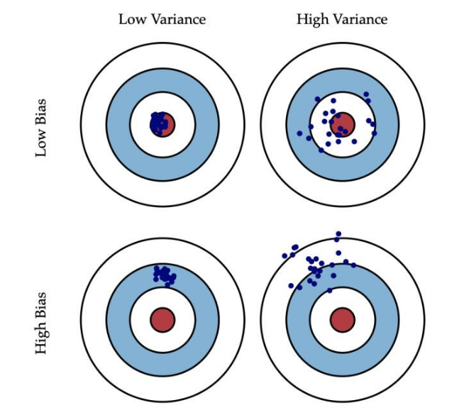

---
## Weight Decay
### L2 Regularization
L2正则化指在损失函数上加上正则项，即：
$$\hat{E}(\mathbf{w})=E(\mathbf{w})+\frac{\lambda}{2}\mathbf{w^T w}$$
正则化项可以解释为：参数$w$先验分布为零均值的高斯分布，并取负对数：
根据贝叶斯原理，给定数据D时参数的后验概率为：
$$P(\mathbf{w}|D) = \frac{P(D|\mathbf{w}) P(\mathbf{w})}{P(D)}$$
$$-\ln P(\mathbf{w}|D) = -\ln P(D|\mathbf{w}) - \ln P(\mathbf{w}) + \text{const}$$
$$P(\mathbf{w}) = \frac{1}{(2\pi \sigma^2)^{d/2}} \exp \left( -\frac{\|\mathbf{w}\|^2}{2\sigma^2} \right)$$
$$-\ln P(\mathbf{w}) = \frac{1}{2\sigma^2} \|\mathbf{w}\|^2 + \text{const}$$
$$\text{Total Loss} = \underbrace{-\ln P(D|\mathbf{w})}_{E_D(\mathbf{w})} + \underbrace{\frac{1}{2\sigma^2} \|\mathbf{w}\|^2}_{\Omega(\mathbf{w})}$$
L2正则化后的参数更新（mini-batch）如下：
$$\nabla_{\mathbf{w}_k}\hat{E}(\mathbf{w})=\frac{1}{b}\sum_t \nabla_{\mathbf{w}_k}E(\mathbf{w})+\lambda \mathbf{w_k^T}$$
$$\mathbf{w}_k\leftarrow (1-\lambda)\mathbf{w}_k-\eta\frac{1}{b}\sum_t \nabla_{\mathbf{w}_k}E(\mathbf{w})$$

L2正则化会限制权重值保持较小，避免权重值过大拟合复杂函数。
对于不同的参数L2正则化影响不同，对于原始损失函数较敏感的参数，正则化影响较小，如果原始损失函数对于某些参数不敏感，正则化能够更大地影响该参数取值，使其趋于0；此外$\lambda$越大，正则化效果越强，部分参数趋于零可以看作不被激活，此时**正则化等价于减小模型参数量**
### 一致性正则化
普通的正则化将不同参数同样处理，如果对输入或输出进行线性变化，我们希望训练得到的模型参数能够相应的缩放使得整个网络等价。
如输入放大10倍，权重值应当缩小10倍使得输出不变；如果此时使用简单的L2正则化，损失函数中的正则项会缩小100倍，导致训练中惩罚项失衡，同时其他参数会相应地受到影响；
解决方法时对不同层或者不同组参数进行不同地正则化，一致性正则化项为：
$$\Omega(\mathbf{w})=\frac{1}{2}\sum_k\alpha_k ||\mathbf{w}||_k^2$$
$$ ||\mathbf{w}||_k^2=\sum_{j\in W_k}w_j^2$$
### 一般权重衰减正则化
L2正则化可以推广为：
$$\Omega(\mathbf{w})=\frac{\lambda}{2}\sum_{j=1}^M|w_j|^q$$
p=1时，被称为LASSO项。
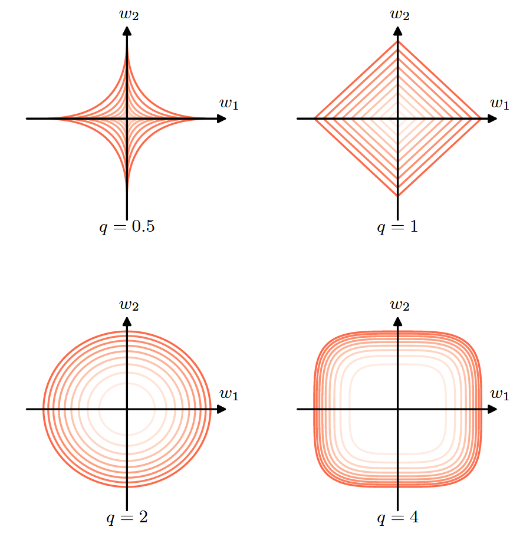

### 限制约束问题
加上正则项的损失函数优化问题可以转换为带限制的优化问题，即
$$\min_{\mathbf{w}} E_D(\mathbf{w}) \quad \text{subject to} \quad \|\mathbf{w}\|^2 \leq \eta$$
对于该问题，可以通过拉格朗日方法求解；
**正则化系数 $\lambda$ 与限制范围 $\eta$ 之间存在反向单调关系**：
- **大的 $\lambda$** 对应**小的 $\eta$**：正则化越强，意味着对参数的限制越严苛，可行域越小。
- **小的 $\lambda$** 对应**大的 $\eta$**：正则化越弱，限制越宽松，允许权重达到更大的数值以拟合数据。
限制优化问题可以通过投影梯度下降求解，即现根据原始损失函数进行梯度下降，当参数超过限制范围后，重新将参数投影至最近的满足条件的位置。

受限优化问题相对于惩罚项的**优势**：
- 如果已知$\eta$的取值，直接求解受限优化问题不需要搜寻合适的正则化系数$\lambda$;
- 惩罚项可能会导致非凸优化问题，导致解陷入局部极小值；
- 惩罚项+高学习率可能导致参数沿某一方向持续更新，而重投影能保证参数始终在合理的范围。

---
## Data Augmentation
一般来说，训练数据越多，模型表现越好；因此对于某些任务，我们可以通过构建更多的数据用于训练，以提高模型泛化能力。
对于图像识别任务，可以通过对图像进行旋转，缩放，加噪等变换来创建新数据，使得模型能够在这些变化下保持输出不变；对于语音识别任务，一般可以采用直接在输入加上噪声提高模型对于噪声的鲁棒性。
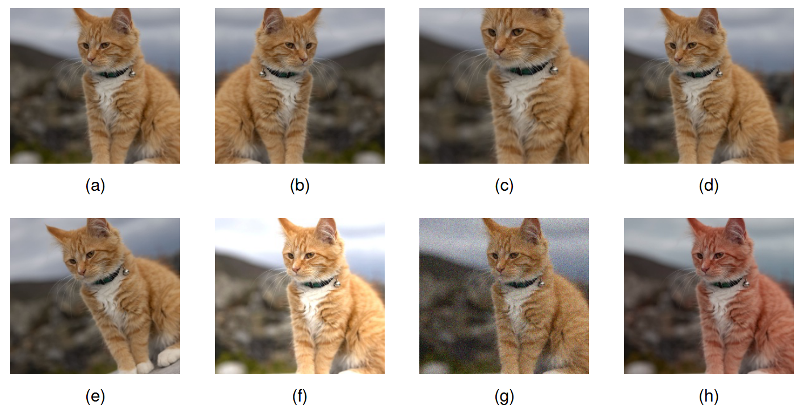
### Mixup/CutMix
与之前的旋转，平移等操作不同，Mixup和CutMix是利用多个样本生成新数据，效果更好。
#### Mixup 
指随机选取两个不同类的样本数据，并通过加权平均将两个样本融合为新的样本，并使用混合后的标签作为新样本的标签，训练模型使其能够学习不同类别之间的线性转变。比如选择一张狗的图片和一张猫的图片，将像素值求和取平均，并将标签设置为0.5概率为狗，0.5为猫，作为新数据用于训练模型，使得模型能够学习到该样本介于两种类别之间。
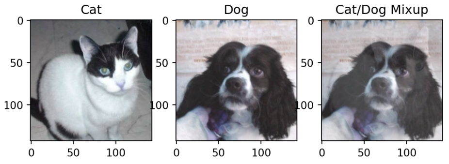
#### CutMix
CutMix 指将不同样本的不同部分拼接成新样本，并根据样本比例创建新标签。比如将两张图片不同区域拼接，得到新的图片用于训练。
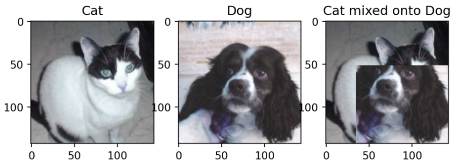
上述操作再图像分类任务中表现很好，尤其是数据匮乏的情况下，减轻了过拟合同时提高了准确率，让模型学习到不同类别之间的过渡关系；但是如果不同类别之间差别过大（如“狗”和“汽车”），会导致混合后的样本无意义，导致模型性能变差。如果训练数据充足，上述数据增强的方法可能引入不必要的噪声，导致结果变差。

---
## Noise Robustness
### 权重加噪
数据增强可以理解为在输入中加入额外噪声，另一种正则化方法是在权重中加入噪声，例如在模型权重中引入随机扰动$\mathbf{\epsilon_w}- N(0,\mathbf{\eta I})$，得到的模型为$\hat{y}(\mathbf{x}; \mathbf{w})$, 则目标函数为：
$$\tilde{E}_W = \mathbb{E}_{\mathbf{x}, y, \boldsymbol{\epsilon}_W} \left[ (\hat{y}(\mathbf{x}; \mathbf{w} + \boldsymbol{\epsilon}_W) - y)^2 \right]$$
对模型输出关于权重泰勒展开，可以近似得到：
$$\tilde{E}_W \approx \underbrace{\mathbb{E}_{\mathbf{x}, y} [(\hat{y}(\mathbf{x}; \mathbf{w}) - y)^2]}_{J_{original}} + \underbrace{\eta \mathbb{E}_{\mathbf{x}} [\|\nabla_{\mathbf{w}} \hat{y}(\mathbf{x})\|^2]}_{\text{Regularization Term}} \quad$$
即在权重中引入误差等价于在目标函数中引入额外的正则项$\eta \mathbb{E}_{\mathbf{x}} [\|\nabla_{\mathbf{w}} \hat{y}(\mathbf{x})\|^2]$。
*该正则化方法可以使得输出对参数的小扰动不敏感，即更新至平坦极小值区域。*
#### 推导过程
当噪声 $\boldsymbol{\epsilon}_W$ 较小时，我们将 $\hat{y}(\mathbf{x}; \mathbf{w} + \boldsymbol{\epsilon}_W)$ 在 $\mathbf{w}$ 处展开：
$$\hat{y}(\mathbf{x}; \mathbf{w} + \boldsymbol{\epsilon}_W) \approx \hat{y}(\mathbf{x}; \mathbf{w}) + \boldsymbol{\epsilon}_W^T \nabla_{\mathbf{w}} \hat{y}(\mathbf{x}; \mathbf{w}) + \frac{1}{2} \boldsymbol{\epsilon}_W^T \nabla_{\mathbf{w}}^2 \hat{y}(\mathbf{x}; \mathbf{w}) \boldsymbol{\epsilon}_W$$
代入平方误差项并展开，令 $\text{error} = \hat{y}(\mathbf{x}; \mathbf{w}) - y$，代入平方项中（忽略二阶以上的高阶项）：
$$(\hat{y}(\mathbf{x}; \mathbf{w} + \boldsymbol{\epsilon}_W) - y)^2 \approx \left( \text{error} + \boldsymbol{\epsilon}_W^T \nabla_{\mathbf{w}} \hat{y} + \frac{1}{2} \boldsymbol{\epsilon}_W^T \nabla_{\mathbf{w}}^2 \hat{y} \boldsymbol{\epsilon}_W \right)^2$$
展开后得到：
$$\text{error}^2 + 2 \cdot \text{error} \cdot (\boldsymbol{\epsilon}_W^T \nabla_{\mathbf{w}} \hat{y}) + (\boldsymbol{\epsilon}_W^T \nabla_{\mathbf{w}} \hat{y})^2 + \text{error} \cdot (\boldsymbol{\epsilon}_W^T \nabla_{\mathbf{w}}^2 \hat{y} \boldsymbol{\epsilon}_W)$$
对噪声 $\boldsymbol{\epsilon}_W$ 求期望值，利用噪声的统计特性 $\mathbb{E}[\boldsymbol{\epsilon}_W] = \mathbf{0}$ 和 $\mathbb{E}[\boldsymbol{\epsilon}_W \boldsymbol{\epsilon}_W^T] = \eta \mathbf{I}$：
- **一次项消失**：$2 \cdot \text{error} \cdot (\mathbb{E}[\boldsymbol{\epsilon}_W]^T \nabla_{\mathbf{w}} \hat{y}) = 0$。
- **平方项转化**：$\mathbb{E}[(\boldsymbol{\epsilon}_W^T \nabla_{\mathbf{w}} \hat{y})^2] = \nabla_{\mathbf{w}} \hat{y}^T \mathbb{E}[\boldsymbol{\epsilon}_W \boldsymbol{\epsilon}_W^T] \nabla_{\mathbf{w}} \hat{y} = \eta \|\nabla_{\mathbf{w}} \hat{y}\|^2$。
- **二阶项简化**：$\text{error} \cdot \mathbb{E}[\boldsymbol{\epsilon}_W^T \nabla_{\mathbf{w}}^2 \hat{y} \boldsymbol{\epsilon}_W] = \eta \cdot \text{error} \cdot \text{Tr}(\nabla_{\mathbf{w}}^2 \hat{y})$。
在许多情况下（如模型已接近收敛，误差 $\text{error} \approx 0$），最后一项可以忽略。最终目标函数近似为：
$$\tilde{J}_W \approx \underbrace{\mathbb{E}_{\mathbf{x}, y} [(\hat{y}(\mathbf{x}; \mathbf{w}) - y)^2]}_{J_{original}} + \underbrace{\eta \mathbb{E}_{\mathbf{x}} [\|\nabla_{\mathbf{w}} \hat{y}(\mathbf{x})\|^2]}_{\text{Regularization Term}} \quad$$

---
### 输出加噪 (Label Smoothing)
我们还可以通过在输出标签中引入噪声，又称 “Label smoothing” 实现正则化效果。在标准的分类任务中，一般采用 “one-hot” 标签，即标签由0或1组成，如果数据集的标签出错，就会导致模型性能下降；此外模型预测容易变得极端。
$$[1, \underbrace{0,...,0}_{k-1} ], [1-\epsilon, \underbrace{\frac{\epsilon}{k-1},...,\frac{\epsilon}{k-1}}_{k-1}]$$
标签平滑是指将分类任务中 softmax 输出的k个值中的0和1变为$\frac{\epsilon}{k-1}$和$1-\epsilon$，该方法能够有效避免模型过于极端与自信；同时，标签平滑增加了偏差，进而降低了方差，能够提高模型性能。

---
## 早停机制（Early Stopping）
学习曲线一般用训练集以及验证集上的损失函数值随训练迭代步数的关系表示，随着迭代次数增加，验证集损失值一般先下降后上升，表征模型性能逐步提高，之后性能下降。该行为可以用模型的有效参数解释，训练早期模型有效参数逐步增加，模型复杂度增加，拟合效果变优；当有效参数超过一定阈值，模型有效参数过多，开始过拟合，表现变差。

早停，指在模型训练到损失值最小，即过拟合之前停止训练，得到的模型性能最优。该方法在效果层面等价于权重衰减正则化，以二次损失函数为例，正常训练过程逐步迭代更新至最优解$w^*$，早停机制使得参数在更新至$\hat{w}$处停止；这等价于通过权重衰减将参数限制在较小的区域。理论证明可参考《Goodfellow Ch.7.8》

早停需要验证集，这意味着数据没有完全用于训练，为了将全部数据用于训练，需要第二阶段的训练，并且有两种策略：
1. 记录第一次训练时验证集转折点对应的训练步数，在第二次训练时使用全部数据，从头开始训练相同步数；
2. 在第一次训练的参数基础上进行第二次训练，使用全部数据，此时监控验证集上的损失值，当验证集损失低于第一次训练早停时训练集损失后，停止第二阶段训练。
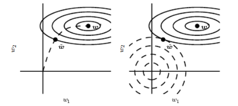
### Double Descent
一般认为，模型参数两很小时，表征能力有限，在测试集上的误差很大；随着参数量增加，测试误差会相应减小；直至参数量过大出现过拟合，测试误差转而增加。但是，深度神经网络往往在具有超大参数量的同时能够保持良好的性能，并且表现处 “double descent” 的现象，即测试误差随模型参数量增加呈现先下降后上升最后第二次下降的特征，如下图所示：
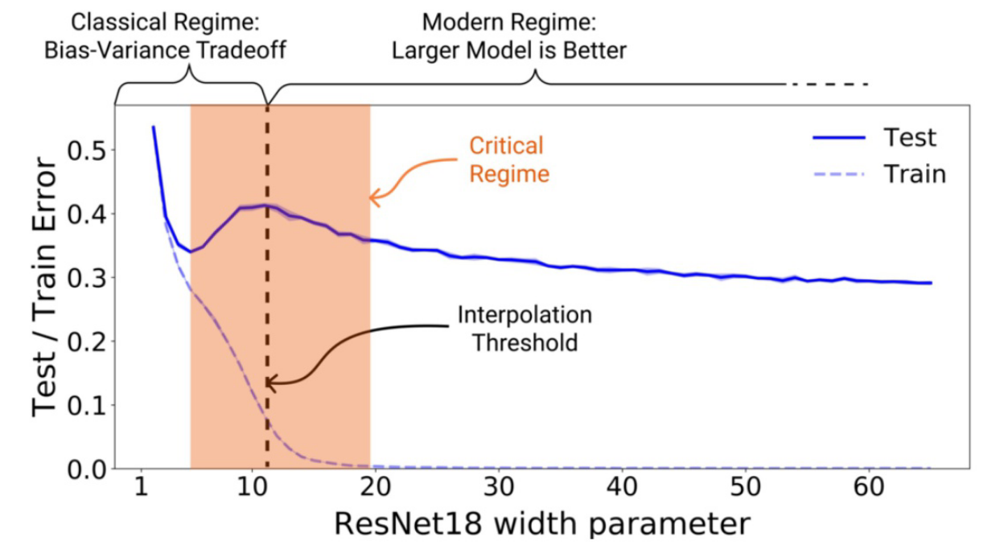
图中存在两个区域，在低复杂度至中复杂度区间，展现出经典的U型曲线，在高复杂度区间，展现出参数越多越好的特征，中间的阈值刚好处于模型参数量足够拟合全部训练数据。考虑测试误差关于训练步数的关系，对于非常大的模型，同样存在 “double descent” 的现象。
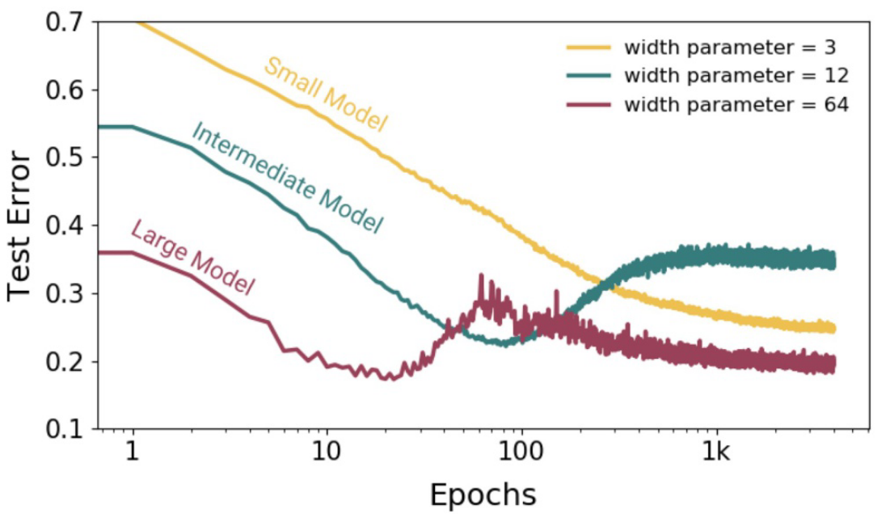
该现象的原因如下：
- 参数足够多时，存在多个能够拟合数据的解（包括过拟合的解）；
- SGD具有隐式偏置，倾向于多个解中更平滑的解；

*Note：该现象同样表明，存在一定的参数量范围，使得增加训练数据，模型表现变差。*

---
## 残差连接

随着神经网络深度增加，梯度消失和梯度爆炸问题会加重，除此之外还会出现“破碎梯度”问题，即网络输出对输入的导数变得极其复杂且剧烈振荡，误差函数表面也变得粗糙，难以通过梯度下降找到最优解。
解决方法是引入残差连接“residual connections”，即将每一层的输入加回到输出中，表达式如下
$$\mathbf{z}_l = \mathbf{z}_{l-1} + \mathbf{F}_l(\mathbf{z}_{l-1})$$
残差连接使得梯度对输入的敏感度降低，误差函数曲面更加光滑；此外多层残差连接整体效果体现为多个不同深度的网络并行，同时具备了深层网络的表征能力。
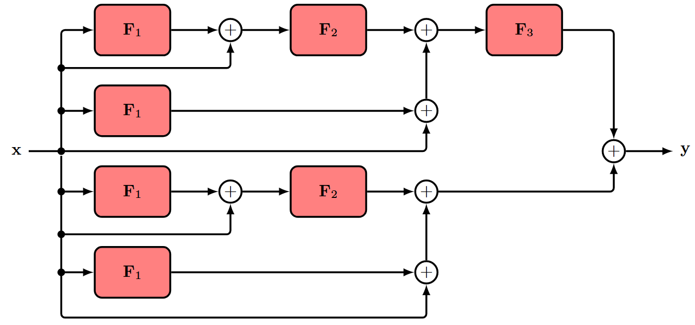
将输入加到输出时，要求输入和输出形状相同，为了能够在网络中改变维度，可以通过引入变换矩阵$W$:
$$\mathbf{z}_l = \mathbf{F}_l(\mathbf{z_{l-1}})+\mathbf{Wz_{l-1}}$$
使用残差连接时，存在两种顺序，如图中所示，一般采用（b）表示的顺序，因为（a）顺序下，被加的输出来自ReLU激活函数，永远为整数，而（b）中正负均可。
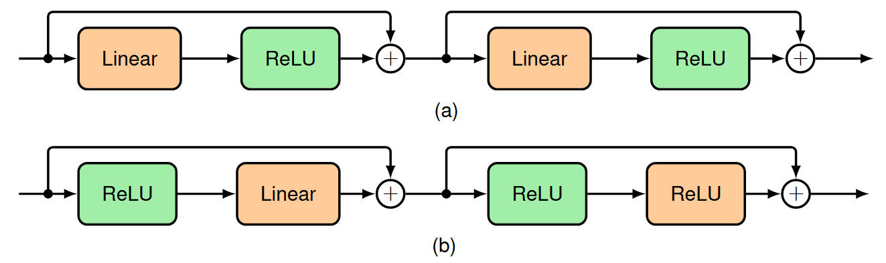

---
## Model Averaging
### Ensemble Methods
对于同一个任务，如果具有多个不同的模型，将各个模型的结果平均往往能取得最好的效果：
$$p(y|x)=\frac{1}{L}\sum_{l=1}^Lp_l(y|x)$$
其中L代表模型总数。
实际应用中，往往只有唯一的数据集，需要在不同模型之间引入区别，常用的方法包括“bootstrap”和“boosting”.
1. **Bootstrap/Bagging**
假设原始数据集包括N个样本$\mathbf{X}=\{\mathbf{x}_1,...,\mathbf{x}_N \}$ ,我们可以通过从中有放回的选择N个样本构成一个新数据集$\mathbf{X}_B$，重复L次即可得到L个不同的数据集，并且每个数据集大小均为N；之后可以使用每个数据集训练一个模型，最后将不同模型的预测平均得到结果。
该方法通过平均M个模型的结果，理论上可以使得整合后的结果误差是原先单个模型结果误差的$1/M$倍，实际考虑到各个模型的相关性，误差缩小系数会更大，但仍能保证小于单个模型误差。
2. **Boosting**
另一种方法为 ”Boosting“，该方法通过聚合多个简单的基本分类器实现更好的效果。
与上述方法不同的是：
- Boosting 逐个训练基本分类器，并且当前训练的分类器依赖于上一个分类器；
- 训练集由数据集不同样本加权构成，权重来源于上一个分类器在各个样本上的表现。

*聚合多个模型的方法缺点很明显，需要训练多个模型，并且预测时同样需要使用多个模型，大大增加了计算资源的要求。*
#### 推导过程
聚合模型的预测值为：
$$y_{COM}=\frac{1}{M}\sum_{m=1}^My_m(x)$$
假设每个模型的预测值与真值$h(x)$存在偏差$\epsilon_m(x)$，则误差平方和的期望为：
$$\mathbb{E}_x[{y_m(x)-h(x)}^2]=\mathbb{E}_x[\epsilon_m(x)^2]$$
单个模型误差的平均为:
$$E_{\text{AV}} = \frac{1}{M} \sum_{m=1}^{M} \mathbb{E}_{\mathbf{x}} [\epsilon_m(\mathbf{x})^2]$$
聚合模型的误差为：
$$E_{\text{COM}} = \mathbb{E}_{\mathbf{x}} \left[ \left( \frac{1}{M} \sum_{m=1}^{M} y_m(\mathbf{x}) - h(\mathbf{x}) \right)^2 \right]$$
$$E_{\text{COM}} = \mathbb{E}_{\mathbf{x}} \left[ \left( \frac{1}{M} \sum_{m=1}^{M} \epsilon_m(\mathbf{x}) \right)^2 \right]$$
假设：
- 均值为零$\mathbb{E}[\epsilon_m(\mathbf{x})] = 0$；
- 不同模型误差不相关：$\mathbb{E}[\epsilon_m(\mathbf{x})\epsilon_l(\mathbf{x})] = 0$ ($m \neq l$)
则聚合模型的误差为逐个模型误差平均的$1/M$倍：
$$E_{\text{COM}} = \frac{1}{M} E_{\text{AV}}$$

### Droupout
Droupout 是另一种非常高效的正则化方法，该方法可以看作通过一次训练整合了指数级的多个模型。其核心思想是在训练过程中，从神经网络中随机地删除部分节点及其连接，并且对于每个样本选择不同。
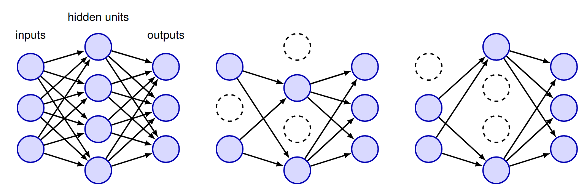
实际使用时，只舍弃隐藏元或输入节点，不删除输出节点，对于节点$i$，乘上掩码向量$R_i\in \{0,1 \}$实现舍弃神经元，节点保留概率由$\rho$决定，一般对于隐藏神经元$\rho=0.5$，对于输入节点$\rho=0.8$。
训练过程中，对于每个数据点或每一个batch，根据各个节点的保留概率$\rho$生成掩码向量，正常进行前向传播和反向传播，最后更新参数。
假设神经网络中包括M个允许舍弃的节点，那么随机舍弃后最多共有$2^M$个不同的子网络，其中的一部分在训练过程中使用，这些网络不完全独立，公用部分的参数。
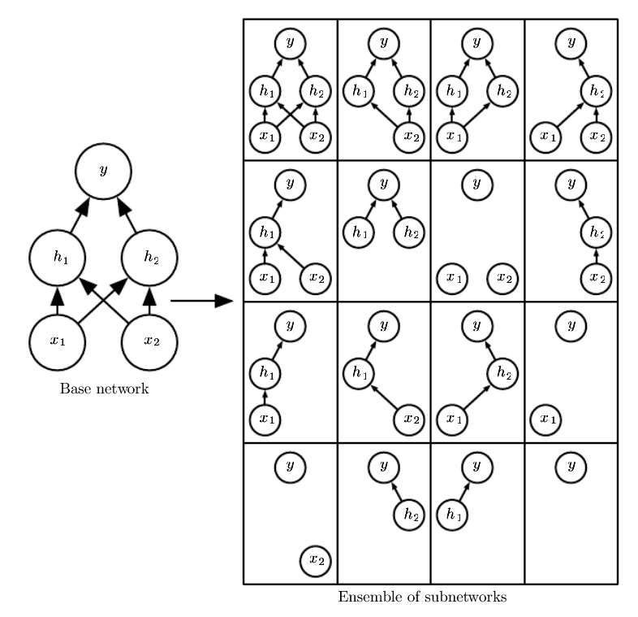
训练结束后，模型的预测结果采用类似聚合方法计算：
$$p(\mathbf{y}|\mathbf{x})=\sum_Rp(\mathbf{R})p(\mathbf{y|x,R})$$
其中掩码向量$R$具有指数量级种组合，逐个计算不现实。实际中，一般整合$10-20$种不同的掩码即可取得较好的结果。上述过程称为 **”Monte Carlo dropout“**。

使用**几何平均**整合预测结果：
$$p(\mathbf{y}|\mathbf{x})=\sqrt[2^d]{\prod_Rp(\mathbf{y|x,R})}$$
其中$d$为舍弃的节点数量。

另一种计算预测结果的方法为”权重缩放法“，直接使用整个网络计算结果，但是各个节点的权重根据保留概率缩放，近似得到预测值。
$$W_{test}=\rho W_{train}$$
如对于隐藏元，保留概率为0.5，则训练完成后，将其权重值除以2，用作最终的权重值。权重缩放法在神经网络不包含非线性操作时严格成立，对于一般网络没有严格证明，但是经验表明结果很好。

Dropout 除了能够提高模型泛化能力之外，还能有效**减轻过拟合**。在标准网络的训练中，隐藏层的节点往往会变得“过度专业化”（Over-specialized）。这意味着某个神经元可能会调整自身的权重，仅仅是为了修正其他特定神经元所产生的错误。这种复杂的相互依赖关系（即协同适应）导致模型极易拟合训练数据中的噪声，从而失去泛化能力。而 Dropout 在训练过程中随机“关闭”一部分神经元，每个神经元都无法依赖其他特定的神经元是否存在。这迫使每个神经元必须在更广泛的上下文环境中都能做出有用的预测，而不是依赖于某些特定的“邻居”。这种独立性显著降低了神经元之间的特定依赖，增强了模型的鲁棒性。
Dropout 会减少模型的有效容量，为了弥补这一点，需要增大模型尺寸以及训练迭代步数，导致消耗更多的计算资源；当训练集样本很少时，Dropout 可能效果欠佳；

**Dropout 方法从另外的视角看相当于在隐藏神经元状态中加入了掩码噪声**；与数据增强中重构输入数据不同，Dropout 能够自适应的重构隐藏状态的内容。例如，模型的隐藏元$h_i$学习到可以通过鼻子识别面部，如果训练中舍弃该隐藏元$h_i$，相当于将输入中的鼻子掩码，强迫模型学习利用其它特征识别面部。数据增强中的输入重构难以在输入中添加结构化的噪声，而Dropout 一定程度上相当于利用模型已经学到的部分隐藏特征重构数据。

---
## Tangent Prop
尽管输入数据具有多个维度，但是一般数据只分布在高维空间的低维流形中。
流行假设引出了**切空间距离**算法，该算法假设不同类别的样本分布在不同的流形上，样本在对应流形上变化不会影响分类器输出，因此不同样本之间的距离采用其对应流形之间的距离，为进一步简化运算，采用流形的切空间之间的距离表示样本的区别。
类似的算法有 **“切向传播”（“Tangent Prop”）** 算法，该算法通过训练时引入惩罚项，保证神经元输出$f(\mathbf{x})$在给定变换下局部不变，这些变换对应在样本类别流形上的移动。这种局域不变性通过使输出$f$在给定输入$\mathbf{x}$对应流形的切向$\mathbf{v}^i$上的方向导数最小实现，等价于加入正则项：
$$\Omega(f)=\sum_i\left ((\nabla_{\mathbf{x}}f(\mathbf{x}))^T\mathbf{v}^i) \right )^2$$
其中切向量一般根据某些特定变换确定，如旋转、平移等。
切向传播算法与数据增强非常相似，均通过已有知识，使得网络对某些变换保持不变。区别主要包括：
- 切向传播不需要显式地新增数据，而数据增强利用变换创建新数据；
- 切向传播只引入了局域的小扰动，而数据增强能够引入较大的扰动；
切向传播的缺点：
- 只能使模型在微小扰动下性能不变；
- 基于无穷小（infinitesimal）分析的方法难以直接应用于基于整流线性单元（ReLU）的模型。
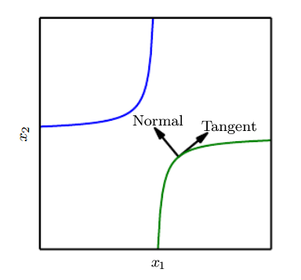

---
## Batch Normalization
可参考 Chapter1/README.md