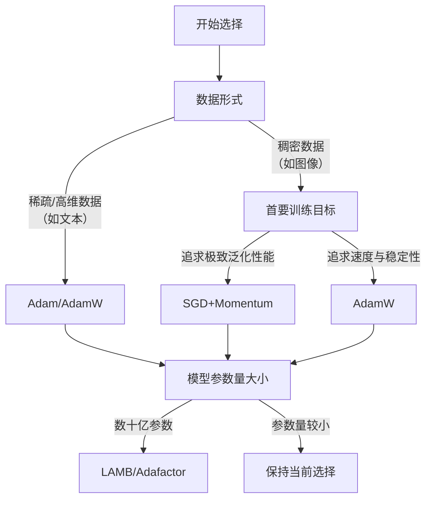
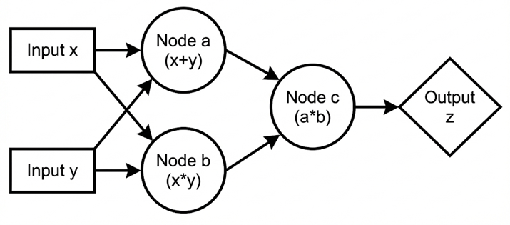

## Introduction
Chapter 1
Gradient Desent && Backpropagation

## GD in Mathematical Optimization
### 问题定义
*   **目标**：寻找目标函数 $ J(\theta) $ 的极小值点（通常为局部极小值）及其对应的参数 $\theta^*$，即 $\theta^* = \arg\min_{\theta} J(\theta)$


*   **挑战**：目标函数通常具有高维、非凸、非线性的复杂特性，且可能伴有噪声。导致无法通过直接解析（如令导数为零）的方法求得全局最优解，必须依赖迭代数值优化算法。

---

### 梯度下降（SGD, Stochastic Gradient Descent）
基于一阶导数的经典迭代优化算法。
**核心思想**：沿着目标函数在当前点的梯度反方向（即函数值下降最快的方向）逐步调整参数，从而逼近函数的局部极小值。

**算法过程**：
1.  **初始化**：随机选择或指定一组参数的初始值 $\theta_0$，设定学习率 $\eta$（步长）和迭代终止条件（如最大迭代次数或梯度范数阈值）。
2.  **迭代更新**：对于第 $k$ 次迭代（$k = 0, 1, 2, ...$）：
    1. **计算梯度** 
    计算目标函数在当前参数 $\theta_k$ 处的梯度：  
    $$
    \nabla J(\theta_k)
    $$
    2. **更新参数** 
    沿梯度反方向调整参数：  
    $$
    \theta_{k+1} = \theta_k - \eta \cdot \nabla J(\theta_k)
    $$
    3. **检查收敛**  
       判断是否满足任一终止条件：
        - 梯度范数 $\|\nabla J(\theta_k)\| = \sqrt{\left( \frac{\partial J}{\partial \theta_1} \right)^2 + \left( \frac{\partial J}{\partial \theta_2} \right)^2 + \dots + \left( \frac{\partial J}{\partial \theta_n} \right)^2}$ 足够小
        - 目标函数值 $J(\theta)$ 变化不明显
        - 达到预设的最大迭代次数  

**相关挑战**：
*   **学习率选择**：固定学习率难以适应训练全过程。
*   **地形问题**：不同参数方向梯度尺度差异巨大（病态条件数，如沟壑/平原），导致收敛缓慢。
*   **局部最优与鞍点问题**：在高维空间，鞍点比局部极值点更常见。

---

### 算法演进
1.  **引入动量（Momentum）**
    *   **核心思想**：模拟物理中的动量，当前更新方向不仅取决于当前梯度，还累积历史梯度的指数加权平均。
    *   **作用**：
        *   **加速收敛**：在梯度方向一致的维度上加速。
        *   **抑制震荡**：通过动量平滑掉不一致的梯度噪声，帮助穿越狭窄的“沟壑”。
    *   **SGD with Momentum**
        引入速度变量 $ \mathbf{v}_t $，其更新规则如下：
        1. **计算动量（速度）**：
        $$
        \mathbf{v}_t = \beta \mathbf{v}_{t-1} + (1 - \beta) \mathbf{g}_t
        $$
        其中：
        * $ \mathbf{g}_t $ 是当前时刻的梯度。
        * $ \beta $ 是动量系数（通常设为0.9），控制历史速度的衰减程度。
        * $ \mathbf{v}_t $ 本质上是历史梯度的一个指数加权移动平均，它积累了之前更新的方向。
        2. **参数更新**：
        $$
        \theta_t = \theta_{t-1} - \eta \mathbf{v}_t
        $$
        其中 $ \eta $ 是学习率。
    *   **SGD with Nesterov Acceleration**
        *   **核心思想**：**前瞻一步**
            * 不像标准动量，先计算当前点的梯度然后叠加动量
            * 而是先让参数沿着当前累积的动量方向（$ \beta \mathbf{v}_{t-1} $）进行**临时更新** ，得到前瞻位置（$\theta_{t-1} - \eta \beta \mathbf{v}_{t-1}$）。然后，**在前瞻位置计算梯度**，用此梯度校正当前的动量更新。
        *   **数学表达**：
            1. **计算前瞻位置的梯度**：
            $$
            \mathbf{g}_t^{lookahead} = \nabla J(\theta_{t-1} - \eta \beta \mathbf{v}_{t-1})
            $$
            2. **更新速度（动量）**：
            $$
            \mathbf{v}_t = \beta \mathbf{v}_{t-1} + (1 - \beta) \mathbf{g}_t^{lookahead}
            $$
            3. **参数更新**：
            $$
            \theta_t = \theta_{t-1} - \eta \mathbf{v}_t
            $$
        *   **e.g.**：当参数在动量作用下冲向谷底时，标准动量会“冲过头”才根据谷底的梯度调整；而NAG会提前“看到”谷底的坡度，从而提前减速并更准确地转向。
        *   使得NAG在理论上**具有更优的收敛率**，在实践中对于循环神经网络（RNN）等模型的训练往往表现更好，能更有效地处理损失函数中的“沟壑”地形。

2.  **自适应学习率（Per-parameter Learning Rate）**
    *   **核心思想**：为网络中**每一个参数**单独调整学习率。根据该参数的历史梯度信息，自动放大或缩小其更新步长。
    *   **RMSProp** (Root Mean Square Propagation)
    引入衰减系数，**只关注近期梯度历史**，淡化遥远过去梯度的影响。从而解决了学习率单调下降的问题，使训练能够持续进行。
    1.  **计算梯度平方的指数移动平均**：
        $$
        E[g^2]_t = \rho \cdot E[g^2]_{t-1} + (1 - \rho) \cdot g_t \odot g_t
        $$
        不累积全部历史梯度平方和，而是计算一个**指数衰减的移动平均**。
        *   $ \rho $ 是衰减率（通常设为0.9）
        *   $ E[g^2]_t $ 可以理解为**近期梯度平方的期望估计**，赋予算法“短期记忆”。
    2.  **参数更新**：
        $$
        \theta_{t} = \theta_{t-1} - \frac{\eta}{\sqrt{E[g^2]_t} + \epsilon} \odot g_t
        $$
    *   **自适应机制**：对于某个参数，如果其历史梯度 $ \sqrt{E[g^2]_t} $ 很大（更新频繁或幅度大），那么其对应的缩放因子就会变小，从而**减小该参数的实际学习步长**。反之，对于历史梯度小的稀疏参数，其有效学习率相对较大。

---

### 主流
1. **Adam** (Adaptive Moment Estimation)
    **同时结合了动量（Momentum）和RMSProp的思想**，通过自适应调整每个参数的学习率来加速收敛并提升训练稳定性。
    1.  **计算梯度的一阶矩估计（动量项）**：
        $$
        m_t = \beta_1 m_{t-1} + (1 - \beta_1) g_t
        $$
        其中
        - $ g_t $ 是当前时间步 $ t $ 的梯度
        - $ m_{t-1} $ 是上一时间步的动量向量
        - $ \beta_1 $是衰减率（通常=0.9）

        相当于对梯度做**指数移动平均**，保留历史梯度方向的信息
    2.  **计算梯度的二阶矩估计（自适应项）**：
        $$
        v_t = \beta_2 v_{t-1} + (1 - \beta_2) g_t^2
        $$
        其中
        - $ g_t^2 $ 表示梯度的逐元素平方
        - $ \beta_2 $是另一个衰减率（通常=0.999）
        
        相当于对梯度平方做**指数移动平均**，反映**各参数历史梯度量级的变化幅度**。量级（对应 $ v_t $）大的参数通常意味着其更新不稳定或梯度本身较大，后续作自适应调节。
    3.  **偏差修正**：
        $$
        \hat{m}_t = \frac{m_t}{1 - \beta_1^t}, \ \hat{v}_t = \frac{v_t}{1 - \beta_2^t}
        $$
        由于 $ m_t $ 和 $ v_t $ 从零向量开始进行指数移动平均，在训练早期（$ t $ 较小时）会严重偏向于零，导致更新步长被低估，使得初期收敛异常缓慢。
        - **期望分析**：
            - 假设梯度 $ g_t $ 平稳，其期望为 $ \mathbb{E}[g_t] = \mu $，方差为 $ \sigma^2 $。
            - 动量项 $ m_t $ 的期望（**未修正**）：
            $$
            \mathbb{E}[m_t] = \mathbb{E}[(1 - \beta_1)\sum_{i=1}^t \beta_1^{t-i} g_i] = (1 - \beta_1^t) \mu
            $$
            - 同理，$ \mathbb{E}[v_t] = (1 - \beta_2^t) \mathbb{E}[g_t^2] $。
        - **修正方法**：
            - 将 $ m_t, v_t $ 除以 $ 1 - \beta^t $：
            $$
            \hat{m}_t = \frac{m_t}{1 - \beta_1^t}, \quad \hat{v}_t = \frac{v_t}{1 - \beta_2^t}
            $$
            - 修正后，$ \mathbb{E}[\hat{m}_t] = \mu $，$ \mathbb{E}[\hat{v}_t] = \mathbb{E}[g_t^2] $，消除了初期偏差。
    4.  **参数更新**：
        $$
        \theta_t = \theta_{t-1} - \eta \cdot \frac{\hat{m}_t}{\sqrt{\hat{v}_t} + \epsilon}
        $$
        其中
        - $ \eta $ 是初始学习率
        - $ \epsilon $ 极小（通常≈$ 10^{-8} $），防止除以零
        - $ \hat{m}_t $ 提供**动量方向**
        - $ \sqrt{\hat{v}_t} $ 起到**逐参数自适应缩放学习率**的作用：对于历史梯度平方和较大的参数，其步长会被缩小；反之则步长相对较大

2.  **AdamW** (Adam with Weight Decay)
    **正则化(Regularization)**:
    *   **核心思想**：在模型的损失函数中添加一个**惩罚项**，约束模型参数的大小，鼓励模型学习更简单、更通用的模式，而不是依赖少数几个特征或极端权重。
    *   $L_{1}$：添加模型**权重绝对值之和**乘以正则化强度系数 λ
        $$
        L_{1} = L(w) + \lambda \sum_{i=1}^{n} |w_i|
        $$
    *   $L_{2}$：添加模型**权重平方和**乘以正则化强度系数 λ
        $$
        L_{2} = L(w) + \lambda \sum_{i=1}^{n} w_i^2
        $$
    
    **将权重衰减（Weight Decay，即L2正则化项）从梯度计算中解耦出来**，直接、独立地应用于参数更新，而非作为损失函数的一部分影响梯度。在标准Adam优化器基础上的一个重要改进。
    1.  **计算梯度的一阶矩估计（动量项）**：与Adam完全相同
    2.  **计算梯度的二阶矩估计（自适应项）**：与Adam完全相同
    3.  **偏差修正**：相同
    4.  **参数更新**：
        $$
        \theta_{t} = \theta_{t-1} - \eta_t \left( \frac{\hat{m}_t}{\sqrt{\hat{v}_t} + \epsilon} \color{blue}{+ \lambda \theta_{t-1}} \right)
        $$
        由两部分组成：
        -   **自适应梯度更新**：$ \eta_t \cdot \frac{\hat{m}_t}{\sqrt{\hat{v}_t} + \epsilon} $，这部分与Adam一致
        *   **解耦的权重衰减**：$ \color{blue}{\eta_t \lambda \theta_{t-1}} $，这是一个**直接、与梯度无关的收缩项**。它独立于自适应学习率机制，以一个固定的速率 $ \lambda $（权重衰减系数）将参数向零收缩。**以实现正则化**

    **与标准Adam（耦合权重衰减）的对比**：
    - 在标准Adam中，权重衰减通常被加入损失函数，即梯度 $ g_t $ 中已经包含了 $ \lambda \theta_{t-1} $ 项。
    - 意味着**权重衰减的效果会被自适应学习率（$ \sqrt{\hat{v}_t} $）所缩放**，导致对于梯度较大的参数，其正则化强度反而被削弱。
    - AdamW通过解耦，确保了**权重衰减的效果是稳定且一致的**，不受参数梯度历史量级的影响。

    **优势总结**：
    - AdamW保留了Adam的所有优点——**动量带来的方向稳定性和自适应学习率带来的各参数步长灵活性**。
    - 通过**解耦权重衰减**，提供了更纯粹、更可控的正则化。使模型在追求高性能的同时，能更好地避免过拟合。
    - 在大容量模型（如Transformer）的训练中，AdamW已成为获得更优泛化能力的首选优化器。

---

### Choose Optimizer


#### 按数据类型
这是最关键的划分依据，直接决定是否使用自适应学习率优化器。

1. 稀疏/高维数据（文本/NLP、推荐系统、多分类任务）
- **适用优化器**：Adam/AdamW
- **核心原因**：数据特征频率差异大（如文本中高频词和稀有词），自适应优化器能为每个参数动态调整学习率：高频特征（梯度大）降低学习率，稀有特征（梯度小）提高学习率，避免“一刀切”导致部分特征学不到。
- **示例场景**：训练大词汇量语言模型（如BERT、GPT）、推荐系统用户-物品交互矩阵学习、文本分类任务。

2. 稠密数据（计算机视觉、图像分类、稠密特征回归）
- **适用优化器**：SGD+Momentum（首选）、AdamW（次选）
- **核心原因**：
  - 稠密数据（如图像像素、连续特征）梯度分布相对均匀，SGD的“噪声更新”能帮助模型跳出尖锐极小值，找到泛化性更好的平坦极小值。
  - 虽然SGD收敛慢，但配合学习率调度（如余弦退火、步衰减）和BatchNorm，最终精度常高于Adam（尤其ImageNet等大型视觉任务）。
- **示例场景**：ResNet等CNN模型训练、ImageNet图像分类、基于稠密特征的回归任务。

#### 按训练优先级
1. 优先训练速度和易用性（快速验证、大规模训练）
- **适用优化器**：Adam、AdamW（首选）
- **核心原因**：
  - 收敛速度快，无需复杂调参，默认参数适配多数任务，能快速得到可用结果。
  - 对噪声梯度、稀疏梯度鲁棒性强，适合LLM、Transformer、RNN/LSTM等复杂模型（避免训练卡顿）。
  - 大规模训练（如LLM预训练）中，Adam/AdamW能稳定利用GPU/TPU并行计算，降低训练成本（训练成本达数百万美元时，快速收敛至关重要）。
- **示例场景**：LLM预训练（GPT、BERT）、快速验证模型架构、RNN/LSTM训练（处理长序列依赖）。

2. 优先极致泛化性能（学术竞赛、工业部署）
- **适用优化器**：SGD+Momentum（首选）、NAG（进阶）
- **核心原因**：
  - SGD的随机噪声相当于“隐式正则化”，能避免模型过拟合到训练数据的细节，测试集性能更稳定。
  - 配合学习率调度（如warmup+余弦衰减）、权重衰减、BatchNorm，可最大化泛化能力（许多SOTA视觉模型仍依赖此组合）。
- **注意**：需要更多调参成本（学习率、动量系数γ=0.9默认），且训练周期更长。

#### 按内存和硬件限制
1. 超大规模模型（数十亿参数，如GPT-3）
- **适用优化器**：Adafactor、LAMB（替代Adam/AdamW）
- **核心原因**：
  - Adam/AdamW需要存储两个与参数等大的矩向量（m和v），数十亿参数场景下内存占用爆炸；Adafactor通过因式分解二阶矩，大幅降低内存消耗（代价是收敛质量略有下降）。
  - LAMB支持超大数据量（32K/64K样本），通过层归一化更新，避免大批量训练时的梯度爆炸，适合硬件集群并行训练（如Google BERT大规模预训练）。
- **硬件适配**：TPU训练常用Adafactor，GPU集群大批量训练常用LAMB。

2. 内存极紧张（嵌入式设备、小显存GPU）
- **适用优化器**：SGD（首选）、SGD+Momentum（次选）
- **核心原因**：
  - 内存占用最小，仅需存储当前梯度，无需额外存储矩向量（Adam/Adagrad等需额外内存）。
  - 计算开销低，适合嵌入式设备、小显存GPU等资源受限场景。

---

## 梯度下降的收敛理论概括版

- **学习率的选择**

学习率 $\eta$ 是梯度下降算法中的关键参数。若学习率过大，算法可能发生震荡甚至发散；若学习率过小，则收敛速度较慢。

通常要求：

 $0<\eta<\frac{1}{L} \quad(7)$ 

其中 $L$ 为目标函数梯度的Lipschitz常数，定义为梯度的最大变化率。

- **函数的凸性**

对于凸函数 $f(\theta)$ ，梯度下降方法能够保证收敛到全局最小值。凸函数满足：

 $f(\lambda \theta_{1}+(1-\lambda) \theta_{2}) \leq \lambda f(\theta_{1})+(1-\lambda) f(\theta_{2}), \lambda \in[0,1] \quad(8)$ 

对于非凸函数，梯度下降可能会陷入局部最小值或鞍点。对于一个凸函数，梯度下降会最终找到全局最小值。

- **强凸函数与弱凸函数**

对于强凸函数（即损失函数的Hessian矩阵是正定的），梯度下降可以保证收敛到唯一的最小值。强凸函数的定义是：

 $f(\theta) \geq f(\theta^*) + \frac{\mu}{2}|\theta - \theta^*|^2$ 

其中， $\mu$ 是函数的强凸常数， $\theta^*$ 是最优解（最小值点）。

- **梯度下降的收敛速度**

对于Lipschitz连续且凸的函数，梯度下降的收敛速度通常是线性收敛的，即误差 $|\theta^{(t)} - \theta^*|$ 随着迭代次数 $t$ 递减：

 $|\theta^{(t)} - \theta^*| \leq (1-\alpha)^t |\theta^{(0)} - \theta^*|, \quad(10)$ 

其中， $\alpha$ 是一个常数，取决于函数的Lipschitz常数和学习率。

线性收敛意味着误差在每次迭代中按固定比例减少，直到误差足够小。

- **收敛的条件**

- 凸性：若目标函数是凸函数，且学习率 $\eta$ 被选择为合适的范围，则梯度下降能够保证收敛到全局最小值。

- Lipschitz连续性：如果梯度是Lipschitz连续的，即存在常数 $L$ ，使得对于任意 $\theta_1$ 和 $\theta_2$ ，有：

 $|\nabla f(\theta_1) - \nabla f(\theta_2)| \leq L |\theta_1 - \theta_2|, \quad(11)$ 

则梯度下降会以线性速率收敛。

- **梯度下降面临的主要困难**

尽管梯度下降方法具有良好的理论性质，但在实际应用中仍存在以下问题：

- 局部最小值：算法可能停留在局部最优解而非全局最优解；

- 平原区域：梯度接近零，参数更新缓慢；

- 鞍点问题：在高维空间中鞍点普遍存在。

上述问题促使研究者提出了多种梯度下降的变体，即优化算法。

## 一、单变量函数收敛理论

### 1.1 二次型函数分析

考虑单变量二次型目标函数：
$$
E(w) = \frac{1}{2}aw^2 + bw + c
$$
其梯度下降更新公式为：
$$
w^{(k+1)} = w^{(k)} - \eta \frac{dE(w^{(k)})}{dw}
$$

**收敛性分析：**
在点 $w^{(k)}$ 处进行泰勒展开至二阶：
$$
E(w) = E(w^{(k)}) + E'(w^{(k)})(w - w^{(k)}) + \frac{1}{2}E''(w^{(k)})(w - w^{(k)})^2
$$

根据牛顿法，该二次近似的最小值点为：
$$
w_{min} = w^{(k)} - [E''(w^{(k)})]^{-1} E'(w^{(k)})
$$

由此可得**最优学习率**：
$$
\eta_{opt} = [E''(w^{(k)})]^{-1} = a^{-1}
$$

**收敛行为分类：**

- **$\eta < \eta_{opt}$**：算法单调收敛至最小值
- **$\eta_{opt} < \eta < 2\eta_{opt}$**：振荡收敛至最小值
- **$\eta > 2\eta_{opt}$**：算法发散


### 1.2 非二次函数分析

对一般目标函数进行二阶泰勒展开：
$$
E(w) \approx E(w^{(k)}) + \frac{dE(w^{(k)})}{dw}(w - w^{(k)}) + \frac{1}{2}\frac{d^2E(w^{(k)})}{dw^2}(w - w^{(k)})^2
$$

局部最优学习率近似为：
$$
\eta_{opt} \approx \left[\frac{d^2E(w^{(k)})}{dw^2}\right]^{-1}
$$

**收敛条件**：$\eta < 2\eta_{opt}$

---

## 二、多变量函数优化理论

### 2.1 二次型函数（对角矩阵情形）

考虑参数向量 $\mathbf{w} = [w_1, w_2, ..., w_N]^T$，目标函数为：
$$
E(\mathbf{w}) = \frac{1}{2}\mathbf{w}^T\mathbf{A}\mathbf{w} + \mathbf{b}^T\mathbf{w} + c
$$

当 $\mathbf{A}$ 为对角矩阵时：
$$
E(\mathbf{w}) = \sum_{i=1}^N \left(\frac{1}{2}a_{ii}w_i^2 + b_iw_i\right) + c
$$

各维度独立，最优学习率分别为：
$$
\eta_{opt,i} = \left[\frac{\partial^2 E}{\partial w_i^2}\right]^{-1} = \lambda_{ii}^{-1}
$$

**关键结论：**

1. 采用统一步长 $\eta$ 时，收敛要求：$\eta < 2\min_i\{\eta_{opt,i}\}$

2. 定义**条件数**：
   $$
   \kappa = \frac{\lambda_{\min}}{\lambda_{\max}} = \frac{\min_i\{\eta_{opt,i}\}}{\max_i\{\eta_{opt,i}\}}
   $$
   条件数越小，收敛速度越慢

### 2.2 坐标变换方法

为解决不同维度最优学习率差异问题，进行坐标变换：
$$
\hat{\mathbf{w}} = \mathbf{S}\mathbf{w}, \quad \mathbf{S} = \mathbf{A}^{1/2}
$$

变换后目标函数简化为：
$$
E(\hat{\mathbf{w}}) = \frac{1}{2}\hat{\mathbf{w}}^T\hat{\mathbf{w}} + \hat{\mathbf{b}}^T\hat{\mathbf{w}} + c
$$

此时梯度变换关系为：
$$
\nabla_{\hat{\mathbf{w}}}E = \nabla_{\mathbf{w}}E \cdot \mathbf{A}^{-1/2}
$$

参数更新公式变为：
$$
\mathbf{w}^{(k+1)} = \mathbf{w}^{(k)} - \eta\mathbf{A}^{-1}\nabla_{\mathbf{w}}E(\mathbf{w}^{(k)})^T
$$

**最优学习率**：$\eta = 1$


### 2.3 牛顿二阶方法（一般函数）

#### 2.3.1 基本原理

对一般函数进行二阶泰勒展开：
$$
E(\mathbf{w}) \approx E(\mathbf{w}^{(k)}) + \nabla E(\mathbf{w}^{(k)})^T(\mathbf{w} - \mathbf{w}^{(k)}) + \frac{1}{2}(\mathbf{w} - \mathbf{w}^{(k)})^T\mathbf{H}_E(\mathbf{w}^{(k)})(\mathbf{w} - \mathbf{w}^{(k)})
$$

参数更新公式：
$$
\mathbf{w}^{(k+1)} = \mathbf{w}^{(k)} - \eta\mathbf{H}_E^{-1}(\mathbf{w}^{(k)})\nabla E(\mathbf{w}^{(k)})^T
$$

其中 $\eta = 1$ 为最优值（满足 $\eta < 2$）。

#### 2.3.2 几何解释

牛顿方法等价于：

1. 在当前点用二次型局部拟合目标函数
2. 对该二次型采用最优步长直接优化至最小值
3. 本质上是对Hessian矩阵进行特征分解后的坐标变换

**数学表示**：
$$
\mathbf{H} = \mathbf{U}^T\boldsymbol{\Lambda}\mathbf{U}, \quad \hat{\mathbf{w}} = \mathbf{U}\mathbf{w}
$$


#### 2.3.3 局限性

1. **计算复杂度高**：Hessian矩阵求逆为 $O(N^3)$ 复杂度
2. **稳定性问题**：在非凸区域，Hessian矩阵可能非正定，导致算法发散
3. **局部极值问题**：固定学习率容易陷入局部最小值

---

## 三、自适应步长方法

### 3.1 Rprop方法

**核心思想**：根据梯度符号变化调整步长

**更新规则**：

- 当前梯度与上一步梯度同号：增大步长
  $$
  \Delta w^{(k)} = \alpha \Delta w^{(k-1)}, \quad \alpha > 1
  $$

- 当前梯度与上一步梯度异号：回退并缩小步长
  $$
  w^{(k)} = w^{(k-1)}, \quad \Delta w^{(k-1)} = \beta \Delta w^{(k-2)}, \quad \beta < 1
  $$

### 3.2 QuickProp方法

**基本假设**：各参数维度相互独立

**更新公式**：
$$
w_i^{(k+1)} = w_i^{(k)} - \left[\frac{\partial^2 E}{\partial w_i^2}\right]^{-1} \frac{\partial E}{\partial w_i}
$$

**二阶导数近似**（有限差分法）：
$$
\frac{\partial^2 E}{\partial w_i^2} \approx \frac{\Delta w_i^{(k-1)}}{E'(w_i^{(k)}) - E'(w_i^{(k-1)})}
$$

### 3.3 动量法

**基本思想**：使用历史更新方向的指数移动平均

**更新公式**：
$$
\Delta \mathbf{W}^{(k)} = \beta\Delta \mathbf{W}^{(k-1)} - \eta\nabla L(\mathbf{W}^{(k-1)})^T
$$

**典型参数**：$\beta = 0.9$

**优势**：

- 平滑收敛方向，抑制振荡
- 在一致方向上积累动量，加速收敛


### 3.4 Nesterov加速梯度法

**改进思路**：先沿动量方向"前瞻"，再计算该位置的梯度

**更新公式**：
$$
\Delta \mathbf{W}^{(k)} = \beta\Delta \mathbf{W}^{(k-1)} - \eta\nabla L(\mathbf{W}^{(k-1)} + \beta\Delta \mathbf{W}^{(k-1)})^T
$$

**优势**：比标准动量法具有更好的理论收敛性质


---

## 四、SGD收敛性理论

### 4.1 收敛定义与条件

**收敛定义**：
$$
|f(\mathbf{w}^{(k)}) - f(\mathbf{w}^*)| < \epsilon
$$

**充分条件**（理论保证）：
$$
\sum_{k=1}^{\infty} \eta_k = \infty, \quad \sum_{k=1}^{\infty} \eta_k^2 < \infty
$$

**实践策略**：

- 强凸函数：采用 $1/k$ 衰减策略可达最优收敛速度
- 一般情况：需要适当衰减学习率保证收敛

### 4.2 收敛速度比较

| 算法类型         | 函数类别   | 误差衰减               | 收敛速度              | $\epsilon$-精度所需迭代次数 |
| ---------------- | ---------- | ---------------------- | --------------------- | --------------------------- |
| **SGD**          | 强凸函数   | $1/k$                  | $O(1/k)$              | $O(1/\epsilon)$             |
|                  | 一般凸函数 | $1/\sqrt{k}$           | $O(1/\sqrt{k})$       | $O(1/\epsilon^2)$           |
| **Batch GD**     | 强凸函数   | 指数衰减               | $O(\log(1/\epsilon))$ | $O(\log(1/\epsilon))$       |
|                  | 一般凸函数 | -                      | $O(1/\epsilon)$       | $O(1/\epsilon)$             |
| **Minibatch GD** | 一般凸函数 | $O(1/\sqrt{bk} + 1/k)$ | 优于SGD               | 依赖batch大小 $b$           |

### 4.3 算法选择指导

**SGD优势**：

- 每次迭代计算量小
- 适合大规模数据集
- 总体收敛速度可能更快

**Batch GD特点**：

- 每次迭代需要完整数据集
- 迭代次数少但每次迭代代价高

**Minibatch GD实践建议**：

1. **平衡效率与稳定性**：batch大小适中（通常32-256）
2. **并行计算友好**：适合GPU等硬件加速
3. **噪声与收敛平衡**：适当噪声有助于跳出局部极小值

**实际应用考虑**：

- 目标函数通常非凸，mini-batch表现更稳健
- 需要根据具体问题和计算资源调整batch大小
- 学习率衰减策略对最终收敛至关重要

## Backpropagation && GD in Neural Network
### Neural Network
1. **Feedforward Neural Network Intro**
    * 由大量相互连接的神经元组成的计算模型，通过层层非线性变换，能够学习输入与输出之间复杂的映射关系。
    * 信息单向流动，数据从输入层经过隐藏层最终到达输出层，没有循环或反馈连接
2.  **问题定义**
    *   **目标**：寻找一组最优权重参数，最小化损失函数，使模型预测最准确。
    *   **挑战**：高维、非凸、非线性的复杂优化问题，无法直接解析求解。
3.  **核心方法**
    *   **反向传播（Backpropagation）**：计算梯度。高效、精确地计算损失函数对百万乃至亿级权重的梯度（导数）。
    *   **梯度下降（Gradient Descent）**：更新模型参数。利用梯度信息，迭代地更新权重，引导模型向最优解移动。

---

### 模型损失函数 && 反向传播
**损失函数**：衡量模型预测与真实目标之间差异的标量函数，训练的目标就是最小化损失函数。  
如用于回归的均方误差（MSE）；用于分类的交叉熵损失（Cross-Entropy）

**反向传播核心步骤**：
1.  **前向传播**：输入数据通过网络层层传递，直至输出层得到预测值。此过程计算并保存每一层的中间激活值，同时计算最终的损失函数值。
2.  **反向传播**：从输出层开始，计算损失函数对输出层输入的梯度，然后利用链式法则，逐层向后计算损失函数对每一层权重和输入的梯度。这个过程中，中间结果的梯度可以被复用，大大提高了计算效率。最终，我们得到损失函数关于网络中所有权重参数的梯度向量 $\nabla_{\theta} L(\theta)$，其中 $\theta$ 代表全部参数。

---

### 反向传播Demo
#### 前向传播
##### 1. 线性层
$$
z = w \cdot x + b
$$
其中：
- $ x $：输入（标量）
- $ w $：权重（标量）
- $ b $：偏置（标量）
- $ z $：线性层输出（标量）

##### 2. 激活函数
$$
a = \sigma(z) = \frac{1}{1 + e^{-z}}
$$

##### 3. 损失函数
$$
\text{loss} = -\left[ y \cdot \log(a) + (1 - y) \cdot \log(1 - a) \right]
$$
其中 $ y $ 是真实标签（0或1）。

#### 反向传播推导
##### 1. 计算损失对激活输出 $ a $ 的梯度
$$
\frac{\partial \text{loss}}{\partial a} = -\left[ \frac{y}{a} - \frac{1-y}{1-a} \right]
$$
化简得：
$$
\frac{\partial \text{loss}}{\partial a} = \frac{a - y}{a(1-a)}
$$

##### 2. 计算激活函数对 $ z $ 的梯度
$$
\frac{\partial a}{\partial z} = a(1-a)
$$

##### 3. 计算损失对线性输出 $ z $ 的梯度（链式法则）
$$
\frac{\partial \text{loss}}{\partial z} = \frac{\partial \text{loss}}{\partial a} \cdot \frac{\partial a}{\partial z}
$$
代入得：
$$
\frac{\partial \text{loss}}{\partial z} = \frac{a - y}{a(1-a)} \cdot a(1-a) = a - y
$$

##### 4. 计算损失对权重 $ w $ 的梯度
由于 $ z = x \cdot w + b $，有：
$$
\frac{\partial z}{\partial w} = x
$$
应用链式法则：
$$
\frac{\partial \text{loss}}{\partial w} = \frac{\partial \text{loss}}{\partial z} \cdot \frac{\partial z}{\partial w} = (a - y) \cdot x
$$

##### 5. 计算损失对偏置 $ b $ 的梯度
由于 $ z = x \cdot w + b $，有：
$$
\frac{\partial z}{\partial b} = 1
$$
应用链式法则：
$$
\frac{\partial \text{loss}}{\partial b} = \frac{\partial \text{loss}}{\partial z} \cdot \frac{\partial z}{\partial b} = a - y
$$

##### 6. 计算损失对输入 $ x $ 的梯度
$$
\frac{\partial z}{\partial x} = w
$$
$$
\frac{\partial \text{loss}}{\partial x} = \frac{\partial \text{loss}}{\partial z} \cdot \frac{\partial z}{\partial x} = (a - y) \cdot w
$$

#### 反向传播公式总结
| 参数 | 梯度公式 |
|------|----------|
| 损失对输出 $ z $ 的梯度 | $\displaystyle \frac{\partial \text{loss}}{\partial z} = a - y = \sigma(z) - y$ |
| 损失对权重 $ w $ 的梯度 | $\displaystyle \frac{\partial \text{loss}}{\partial w} = (a - y) \cdot x$ |
| 损失对偏置 $ b $ 的梯度 | $\displaystyle \frac{\partial \text{loss}}{\partial b} = a - y$ |
| 损失对输入 $ x $ 的梯度 | $\displaystyle \frac{\partial \text{loss}}{\partial x} = (a - y) \cdot w$ |

#### 参数更新公式（梯度下降）
使用学习率 $ \eta $ 更新参数：
$$
w \leftarrow w - \eta \cdot \frac{\partial \text{loss}}{\partial w}
$$
$$
b \leftarrow b - \eta \cdot \frac{\partial \text{loss}}{\partial b}
$$

---

### 梯度下降算法 with Batch Size
梯度下降的核心迭代公式为：
$$
\theta_{t+1} = \theta_t - \eta \cdot \nabla_{\theta} L(\theta_t)
$$
其中 $\eta$ 是学习率，控制更新的步长。  
根据计算梯度时所用数据量的不同，梯度下降主要有三种变体，它们在效率、稳定性和泛化能力上各有权衡：

1.  **（纯）随机梯度下降（SGD）**
    *   **原理**：每次迭代随机使用**一个样本**计算梯度并立即更新。
    *   **收敛速度**：对于一般凸函数，理论收敛速度为$O(1/\sqrt{k})$，k为迭代步数，需要迭代$O(1/\epsilon^2)$次收敛。
    *   **优点**：
        *   **速度极快**，更新频率高。
        *   **引入的噪声有助于跳出局部最优和尖锐极小点**，可能找到泛化更好的平坦解。
    *   **缺点**：**更新方向震荡剧烈**，收敛过程不稳定，难以精细调优。

2.  **批量梯度下降（Batch GD）**
    *   **原理**：每次迭代使用**全部训练数据**计算精确梯度。
    *   **收敛速度**，对于一般凸函数，理论上需要迭代$O(1/\epsilon)$次使得目标函数误差小于$\epsilon$。
    *   **优点**：梯度方差相比单样本缩小$1/N$，梯度方向稳定，理论收敛性好。
    *   **致命缺点**：
        *   **计算成本极高**：每步更新都需遍历全量数据，内存和计算无法承受。
        *   **易陷入局部最优**：更新方向过于“确定”，缺乏探索能力。
        *   **无法在线学习**。

3.  **小批量随机梯度下降（Mini-batch SGD）**
    *   **原理**：将数据划分为若干**小批量（Batch）**，每次使用一个批次的样本估计梯度。
    *   **收敛速度**：对于一般的凸函数，batch取为b时，收敛速率为$O(1/\sqrt{bk}+1/k)$。
    *   **为什么是“估计”？** 小批量梯度是全量数据真实梯度的**无偏但带噪声的估计**。
    *   **“小批量”的平衡艺术**：
        *   **效率**：相比全批量，计算开销小，能充分利用GPU并行计算。
        *   **稳定性**：相比单样本，梯度的方差缩小$1/b$，更新路径更平滑。
        *   **泛化性**：相比全批量，适度的噪声起到正则化作用，防止过拟合。

---


## 反向传播推导
### MSE Loss，均方误差损失

- MSE Loss就是矩阵的Frobenius范数的平方，直观说明就是矩阵中各个元素平方的和，一般会乘一个1/2。

$$
\begin{array}{l}
\\
L \in R, X \in R ^{B \times D}, Y \in R^{B \times D} \\
B是batch, D是维度, X是预测结果, Y是label, Y的每一行是相等的\\
L = \frac 12 ||X-Y||_F^2  \\
=\frac 12 \sum_{ij}(x_{ij}-y_{ij})^2
\end{array}
$$

- 我们需要的是$L$对$X$的梯度，可以推断出$\frac{\partial L}{\partial X}$的形状和$X$是相同的，就是$B\times D$。现在推导表达式：

$$
\begin{array}{l}
\\
(\frac{\partial L}{\partial X})_{ij} = \frac{\partial }{\partial x_{ij}}\frac 12 \sum_{ij}(x_{ij}-y_{ij})^2 \\
= \frac 12 \frac{\partial}{\partial x_{ij}} (x_{ij}-y_{ij})^2 \\
= x_{ij}-y_{ij} \\
\frac{\partial L}{\partial X} = X- Y\in R^{B\times D}
\end{array}
$$

- 此时已经推导完毕，对于任意定义的Loss，只要它是一个标量，那么它对于输入的$X$的导数的形状就是和$X$相同的，只不过表达式在不同Loss下会不同。

### 矩阵乘法

- 首先明确，我们的目的始终是计算出标量损失L对各个量（可以是矩阵，可以是向量）的导数。对于如下的矩阵乘法：

$$
\begin{array}{l}
\\
Y=X\cdot W \\
Y\in R^{B\times D_2}, X\in R^{B \times D_1}, W\in R^{D_1 \times D_2}\\
\end{array}
$$

- B是batch, D_1是输出维度,D_2是输入维度,X是输入,W是权重矩阵,Y是输出
- 假设我们已经计算得到$\frac{\partial L}{\partial Y}\in R^{B\times D_2}$，为了更新$W$，我们需要$\frac{\partial L}{\partial W}$，为了继续反向传播，我们需要$\frac{\partial L}{\partial X}$。现在推导$\frac{\partial L}{\partial W}$，在此之前，需要先推导$\frac{\partial Y}{\partial W}$。
- 先推断$\frac{\partial Y}{\partial W}$的形状，输出是$B\times D_2$的矩阵, 输入是$D_1\times D_2$的矩阵, 所以导数是一个$B\times D_1 \times D_1 \times D_2$的张量。现在只需要推导出张量中位于ijab位置的元素表达式：$(\frac{\partial Y}{\partial W})_{ijab}=\frac{\partial Y_{ij}}{\partial W_{ab}}$。$Y_{ij}$就是$X$的第i行与$W$的第j列的内积，写成表达式就是：$Y_{ij}=X_{[i, :]}\cdot W_{[:, j]}=\sum_{k} x_{ik}\cdot w_{kj}$，由此可以得到：

$$
(\frac{\partial Y}{\partial W})_{ijab}=\frac{\partial y_{ij}}{\partial w_{ab}}=
\begin{cases}
x_{ia} & j=b\\
0 & j\neq b
\end{cases}
$$

- 不难发现上面表达式在ijab给定时，值是确定的，说明确实可以计算得到任意一个位置的导数。
- 此时我们已经推导出$Y$对于$W$的导数，但是我们的目的始终是计算$L$对各个量的偏导数，所以现在使用链式法则计算$\frac{\partial L}{\partial W}$，用标量推导。设我们已经知道$L$对$Y$的导数$\frac{\partial L}{\partial Y} \in R^{B\times D_2}$，记作$G$：

$$
(\frac{\partial L}{\partial W})_{ab} = \sum_{ij}\frac{\partial L}{\partial y_{ij}}\cdot \frac{\partial y_{ij}}{\partial w_{ab}}=\sum_{ij}G_{ij}\cdot \frac{\partial y_{ij}}{\partial w_{ab}} \\
$$

- 由于$j\neq b$时，$\frac{\partial y_{ij}}{\partial w_{ab}}=0$，这部分直接忽略，由此得到：

$$
\begin{array}{l}
\\
(\frac{\partial L}{\partial W})_{ab} = \sum_{ij}G_{ij}\cdot \frac{\partial y_{ij}}{\partial w_{ab}} \\
只有j=b的时候非零, 把所有j换成b, 然后去掉对j的求和, 以为j=b是一个值, 不需要求和 \\
= \sum_{i}G_{ib}\cdot \frac{\partial y_{ib}}{\partial w_{ab}}  \\
使用之前推导得到的y_{ib}对w_{ab}的表达式, 得到: \\
=\sum_{i}G_{ib}\cdot x_{ia} \\
这等价于G的第b列与X的第a列对应元素相乘然后再相加, 写成内积形式: \\
= X_{[a, :]}^T\cdot G_{[:, b]}\\
(X^T_{[a,:]}表示先转置, 然后再取一行)
\end{array} 
$$

- 此时已经推导得到$(\frac{\partial L}{\partial W})_{ab}=X_{[a,:]}^T\cdot G_{[:, b]}$，可以验证$\frac{\partial L}{\partial W} =  X^T \cdot G \in R^{D_1 \times D_2}$。形状也是对得上的，和$W$的形状相同。
- **由此得到结论**：

$$
\begin{array}{l}
\\
Y=X\cdot W \\
Y\in R^{B\times D_2}, X\in R^{B \times D_1}, W\in R^{D_1 \times D_2} \\
G=\frac{\partial L}{\partial Y} \in R^{B\times D_2} \\
有: \\
\frac{\partial L}{\partial W} =  X^T \cdot G \in R^{D_1 \times D_2}
\end{array}
$$

- 如果我们想要得到$\frac{\partial L}{\partial X}$，可以用同样的方法进行分析，但实际上可以用矩阵转置的形式导出结果。

$$
\begin{array}{l}
\\
Y=X\cdot W \\
转置的性质: \\
Y^T = W^T \cdot X^T \\
利用刚才推导的结果: \\
\frac{\partial L}{\partial X^T} = (W^T)^T\cdot\frac{\partial L}{\partial Y^T} = W\cdot G^T \\
两侧取转置: \\
\frac{\partial L}{\partial X} = G\cdot W^T \\
验证形状: \\
(B, D_1)=(B,D_2)\cdot (D_2\cdot D_1)
\end{array} 
$$

- **由此得到结论**：

$$
\begin{array}{l}
\\
Y=X\cdot W \\
Y\in R^{B\times D_2}, X\in R^{B \times D_1}, W\in R^{D_1 \times D_2} \\
G=\frac{\partial L}{\partial Y} \in R^{B\times D_2} \\
有: \\
\frac{\partial L}{\partial X} =  G \cdot W^T \in R^{B \times D_1}
\end{array}
$$

- 这一套结论就是反向传播中最常用的矩阵乘法的反向传播规则，有以下直观的发现。
  - 为了计算$L$对$W$的导数，我们需要在前向传播的时候保存$X^T$。直观理解就是每个线性层的输出都需要保存一份。
  - 虽然推导中需要计算$Y=X\cdot W$中$Y$对$X$的导数，而且发现这个导数是一个四维张量，无论是计算还是存储都有很大代价。但是实际计算中，只需要分别进行一次矩阵乘法就可以得到需要的$L$对$W$和$L$对$X$的导数，计算非常简洁，实现起来也十分容易。

### 矩阵加法，bias

- **矩阵加法**：仍然先明确，我们的目的是计算标量损失L对各个量的导数。那么对于如下的矩阵加法：

$$
\begin{array}{l}
\\
Y = X + B  \\
Y, X,B \in R^{B\times D}
\end{array}
$$

- B是batch，D是维度。假设我们已经计算得到$\frac{\partial L}{\partial Y}\in R^{B\times D_2}$，现在推导$\frac{\partial L}{\partial B}$，在此之前，需要先推导$\frac{\partial Y}{\partial B}$。
- 先推断$\frac{\partial Y}{\partial B}$的形状，输出是$B\times D$的矩阵，输入是$B\times D$的矩阵，所以导数是一个$B\times D \times B \times D$的张量，现在只需要推导出张量中位于ijab位置的元素表达式：$(\frac{\partial Y}{\partial B})_{ijab}=\frac{\partial Y_{ij}}{\partial B_{ab}}$，结果非常直观：

$$
(\frac{\partial Y}{\partial B})_{ijab}=\frac{\partial y_{ij}}{\partial b_{ab}}=
\begin{cases}
1 & i=a ,j=b\\
0 & \text{others}
\end{cases}
$$

- 此时我们已经推导出$Y$对于$B$的导数，现在使用链式法则计算$\frac{\partial L}{\partial B}$，用标量推导，设我们已经知道$L$对$Y$的导数$\frac{\partial L}{\partial Y}\in R^{B\times D}$，记作$G$：

$$
(\frac{\partial L}{\partial B})_{ab} = \sum_{ij}\frac{\partial L}{\partial y_{ij}}\cdot \frac{\partial y_{ij}}{\partial b_{ab}}=\sum_{ij}G_{ij}\cdot \frac{\partial y_{ij}}{\partial b_{ab}} \\
$$

- 由于只有$i=a,j=b$时导数非零，所以得到：

$$
\begin{array}{l}
\\
(\frac{\partial L}{\partial B})_{ab}=G_{ab}\cdot 1=G_{ab} \\
\frac{\partial L}{\partial B}=G \in R^{B\times D}
\end{array}
$$

- 此时已经推导完毕，可以发现对于矩阵加法，L对各个矩阵的导数就是L对各个矩阵的和的导数。**由此得到结论**：

$$
\begin{array}{l}
\\
Y=X+B \\
Y,X,B \in R^{B\times D} \\
G = \frac{\partial L}{\partial Y} \in R^{B\times D} \\
有: \\
\frac{\partial L}{\partial B}= G \in R^{B \times D}
\end{array}
$$

- 对于$\frac{\partial L}{\partial X}$，结论显然是一样的。
- **加bias**：虽然添加bias这个操作完全可以合并到矩阵乘法中，不过这种操作非常常见，这里还是推导一下。对于$Y=X+b$，在数学上一定是要求$X$和$b$形状相同的；不过在torch中，因为广播机制，实际上计算的是$Y=X+\text{ones}(B, 1) \cdot b$，其中$Y,X \in R^{B \times D}, b\in R^{1 \times D}$。因为我们已经推导过矩阵加法的导数，所以现在只需要推导如下内容：

$$
\begin{array}{l}
\\
b \in R^{1 \times D} \\
B=\text{ones}(B, 1)\cdot b \\
x是b的索引 \\
(\frac{\partial B}{\partial b})_{ijx}= 
\begin{cases}
1 & j=x \\
0 & \text{others}
\end{cases}
\end{array}
$$

- 这个推导和之前是类似的，注意此时$\frac{\partial B}{\partial b}$的形状应该是$B \times D \times B$，只有当$B_{ij}$的列索引和$b$的索引相同的时候，导数才是1，否则都是0。
- 设我们已知$\frac{\partial L}{\partial Y} \in R^{B \times D}$，记作$G$，根据之前对矩阵加法导数的推导，对于$Y=X+B$，有$\frac{\partial Y}{\partial B}=G$，现在使用链式法则推导$\frac{\partial L}{\partial b}$：

$$
\begin{array}{l}
\\
(\frac{\partial L}{\partial b})_x = \sum_{ij}G_{ij}\frac{\partial B_{ij}}{\partial b_x} \\
= \sum_i G_{ix}\frac{\partial B_{ix}}{\partial b_x} \\
= \sum _i G_{ix} \cdot 1\\
\frac{\partial L}{\partial b} = \text{ones(1, B)}\cdot G \in R^{1 \times D}
\end{array}
$$

- 由此得到结论：

$$
\begin{array}{l}
\\
Y=X+\text{ones}(B, 1)\cdot b=X+B \\
Y, X, B \in R^{B \times D}, b \in R^{1 \times D}\\
G=\frac{\partial L}{\partial Y} \in R^{B \times D} \\
有: \\
\frac{\partial L}{\partial b}=\sum_{i=1}^B G_{i, :}=\text{ones}(1, B)\cdot G \in R^{1 \times D}
\end{array}
$$

- 直观理解就是把L对Y的导数沿着batch维度求和，然后就得到了L对b的梯度。

### 激活函数，element-wise的操作

- 激活函数普遍都是element-wise的操作，所以自然有如下的推导

$$
\begin{array}{l}
\\
Y=\delta(X)\\
Y,X\in R^{B \times D} \\
先推导\frac{\partial Y}{\partial X}: \\
\frac{\partial Y}{\partial X} \in R^{B\times D \times B \times D} \\
\frac{\partial y_{ij}}{\partial x_{ab}} = \begin{cases}
\delta^{'}(x_{ab}) & i=a,j=b \\
0 & \text{others}
\end{cases} \\
继续推导\frac{\partial L}{\partial X}:
\\
已知\frac{\partial L}{\partial Y}=G\in R^{B \times D}\\
有(\frac{\partial L}{\partial X})_{ab}= \sum_{ij}\frac{\partial L}{\partial y_{ij}}\cdot \frac{\partial y_{ij}}{\partial x_{ab}} \\
=\frac{\partial L}{\partial y_{ab}}\cdot \frac{\partial y_{ab}}{\partial x_{ab}} \\
=\frac{\partial L}{\partial y_{ab}}\cdot \delta^{'}(x_{ab}) \\
得到: \\
\frac{\partial L}{\partial X} = G \odot \delta^{'}(X) \\
这里的\odot 表示哈达玛积, 就是对应元素相乘\\
\end{array}
$$

- 直观理解就是把激活函数的导数作用在输入矩阵的每个元素上，然后将这个矩阵与L对激活值得导数计算哈达玛积，得到的就是L对输入矩阵的导数。
- 下面是常见激活函数的导数的总结：

| **操作**       | **前向计算 Z=f(Y)**                     | **梯度 ∂Y∂L 的通用公式**               |
| -------------- | --------------------------------------- | -------------------------------------- |
| ReLU           | $Z = \max(0, Y)$                        | $G_Y = G_Z \odot \mathbf{1}_{\{Y>0\}}$ |
| Sigmoid        | $Z = \frac{1}{1+e^{-Y}}$                | $G_Y = G_Z \odot Z \odot (1-Z)$        |
| Tanh           | $Z = \frac{e^Y - e^{-Y}}{e^Y + e^{-Y}}$ | $G_Y = G_Z \odot (1-Z^2)$              |
| 幂函数 (Power) | $Z = Y^k$                               | $G_Y = G_Z \odot k \cdot Y^{k-1}$      |
| 对数 (Log)     | $Z = \ln(Y)$                            | $G_Y = G_Z \odot \frac{1}{Y}$          |

- 实际上哈达玛积本身也是一个element-wise的操作：

$$
\begin{array}{l}
\\
Y=P\odot Q \\
Y,P,Q\in R^{B\times D} \\
先推导 \frac{\partial Y}{\partial P} \in R^{B\times D \times B \times D} \\
\frac{\partial y_{ij}}{\partial p_{ab}} = 
\begin{cases}
q_{ab} & a=i,b=j \\
0 & \text{others}
\end{cases} \\
继续推导\frac{\partial L}{\partial P}\\
设\frac{\partial L}{\partial Y} =G \in R^{B \times D} \\
\frac{\partial L}{\partial p_{ab}}=\sum_{ij}\frac{\partial L}{\partial y_{ij}}\cdot \frac{\partial y_{ij}}{\partial p_{ab}} \\
=G_{ab}\cdot q_{ab} \\
\frac{\partial L}{\partial P} = G \odot Q
\end{array}
$$

### 降维操作 

- **对整个向量求和**：$y=\sum_{ij} X_{ij}，y\in R, X\in R^{B\times D}$，求$\frac{\partial y}{\partial X}$以及$\frac{\partial L}{\partial X}$。思路自然是写出$y$对X每个元素的导数，推导如下：

$$
\begin{array}{l}
\\
推断形状: 
\frac{\partial y}{\partial X} \in R ^{B \times D} \\
\frac{y}{\partial x_{ij}} = 1 \\
\frac{\partial y}{\partial X} = \text{ones}(B, D) \\
设已知\frac{\partial L}{\partial y} = g \in R\\
推导\frac{\partial L}{\partial X}: \\
\frac{\partial L}{\partial x_{ij}} = \frac{\partial L}{\partial y}\cdot \frac{\partial y}{\partial x_{ij}} = \frac{\partial L}{\partial y}=g \\
得到\frac{\partial L}{\partial X} = g \cdot \text{ones}(B, D)\in R^{ B \times D}
\end{array}
$$

- 对于mean操作，显然有$\frac{\partial Y}{\partial X}=\frac{1}{B \times D} \cdot \text{ones} (B, D)$，自然得到$\frac{\partial L}{\partial X} = g \cdot \frac{1}{B\times D} \cdot \text{ones}(B, D)\in R^{ B \times D}$。

- **maxpooling**：推导如下：

$$
\begin{array}{l}
\\
y=\max(X), y\in R, X\in R^{B \times D} \\
推断形状: \\
\frac{\partial y}{\partial X} \in R ^{B \times D} \\
\frac{\partial y}{\partial x_{ij}} = \begin{cases}
1 & i,j=\arg \max X\\
0 & \text{others}
\end{cases} \\
设已知\frac{\partial L}{\partial y}=g \in R \\
\frac{\partial L}{\partial x_{ij}} = \begin{cases}
g \cdot 1 & i,j=\arg \max X \\
0 & \text{others}
\end{cases} \\
\frac{\partial L}{\partial X}\in R^{B \times D}
\end{array}
$$

- 可以发现，maxpooling操作实际上就是只保留了最大的输入元素的梯度，其余元素的梯度都是零。

### softmax

- **softmax本身的导数**：
- softmax本身不是一个降维操作，但它和cross-entropy结合之后就构成了一个非常常见的损失函数。先推导softmax本身的导数。

$$
\begin{array}{l}
\\
设输入的样本为: \\
z = (z_1, z_2, \dots, z_C) \in R^{1 \times C} \\
softmax的定义为: \\
p_i = \frac{e^{z_i}}{\sum_{k=1}^C e^{z_k}}, \quad p \in R^{1 \times C} \\
计算\frac{\partial p}{\partial z},先推断形状: \\
\frac{\partial p}{\partial z} \in R^{C \times C} \\
当i=j时 \\
\frac{\partial p_i}{\partial z_i}= \frac{e^{z_i}(\sum_k e^{z_k}) - e^{z_i}e^{z_i}}{(\sum_k e^{z_k})^2}=\frac{e^{z_i}}{\sum_k e^{z_k}}- \frac{e^{z_i}\cdot e^{z_i}}{(\sum_k e^{z_k})^2} \\
= p_i - p_i^2 \\
= p_i(1 - p_i) \\
当i\neq j时 \\
\frac{\partial p_i}{\partial z_j}
= -\frac{e^{z_i}e^{z_j}}{(\sum_k e^{z_k})^2}
= -p_i p_j \\
合并写为: \\
\frac{\partial p_i}{\partial z_j}
= p_i(\delta_{ij} - p_j) \\
其中\delta_{ij}仅在i=j时为1, 否则为0\\
可以写成矩阵形式: \\
\frac{\partial p}{\partial z}
= \mathrm{diag}(p) - p p^\top
\in R^{C \times C}
\end{array}
$$

- 现在假设已知$\frac{\partial L}{\partial p}=G \in R^{1 \times C}$，继续推导$\frac{\partial L}{\partial z}$：

$$
\begin{array}{l}
\\
推断形状: \\
\frac{\partial L}{\partial z}\in R ^{1 \times C} \\
\frac{\partial L}{\partial z_a}=\sum_i \frac{\partial L}{\partial p_i} \cdot \frac{\partial p_i}{\partial z_a} =\sum_i G_i \cdot p_i (\delta_{ia}-p_a) \\
=\sum_i G_i \cdot p_i \cdot \delta_{ia}- \sum_i G_i \cdot p_i \cdot p_a \\
= G_a \cdot p_a - p_a\sum _i G_i \cdot p_i \\
写成矩阵形式(形式不唯一且不重要): \\
\frac{\partial L}{\partial z} = G \odot p - (G\cdot p^T)\cdot p \\
其中G\cdot p^T是一个标量
\end{array}
$$

- **cross-entropy的导数**：
- 现在推导L对cross-entropy的输入的导数$\frac{\partial L}{\partial p}$：

$$
\begin{array}{l}
\\
cross-entropy定义: \\
L = -\sum_{i=1}^C y_i \log p_i,\quad L \in R \\
其中y_i是标签, p_i是softmax的输出 \\
推断形状: \\
\frac{\partial L}{\partial p} \in R ^{1\times C} \\
\frac{\partial L}{\partial p_i} = -\frac{y_i}{p_i}\\
这里缺乏一个严谨的符号来写出矩阵形式的结果, 用./表示对应元素相除: \\
\frac{\partial L}{\partial p} = -y./p \in R^{1 \times C}
\end{array}
$$

- **softmax接cross-entropy的导数**：
- 在已经前述推导的基础上，此时可以推导L对softmax的输入的导数$\frac{\partial L}{\partial z}$：

$$
\begin{array}{l}
\\
已知 p=softmax(z)\in R^{1 \times C}, \quad p, z \in R^{1 \times C} \\
L = -\sum_{i=1}^C y_i \log p_i,\quad L \in R, y\in R^{1 \times C} \\
根据前面推导, 有: \\
\frac{\partial L}{\partial z_a}
= G_a \cdot p_a - p_a\sum _i G_i \cdot p_i \\
也有: \\
G_i = \frac{\partial L}{\partial p_i} = -\frac{y_i}{p_i} \\
两者结合, 得到: \\
\frac{\partial L}{\partial z_a} = G_a \cdot p_a - p_a\sum _i G_i \cdot p_i \\
= -\frac{y_a}{p_a}\cdot p_a + p_a\sum_i \frac{y_i}{p_i}\cdot p_i \\
=-y_a + p_a\sum_i y_i \\
如果y是one-hot矩阵, 则y中只有一个元素是1, 其余都是0, 自然有\sum_iy_i=1,得到: \\
原式=-y_a + p_a =p_a-y_a\\
写成矩阵形式: \\
\frac{\partial L}{\partial z} = p-y\in R^{1 \times C}
\end{array}
$$

- 从结果中可以看到，softmax后面接cross-entropy之后，损失L对softmax的输入的梯度的表达式是非常简洁的。这也是为什么在torch等框架中，softmax和cross-entropy通常被融合成一个算子。
- **log-softmax的说明**：
- 在torch中，为了数值稳定性，实际计算的是log-softmax。它是为了解决如下的问题的。
- 如果没有log-softmax操作，用softmax的定义计算，如果某个$z_i$特别大，那么在计算$p_i$的时候，分子分母都很大会直接溢出。如果某个$z_i$特别小，比如是-1000，那么计算出来的$p_i$会直接数值下溢变成0，后续计算$\log p_i$的时候会有问题，同时也无法区分出-1000和-10000这种logits的差异（因为概率都下溢成0了，没区别了）。注意到在softmax之后计算cross-entropy时，需要的不是$p_i$，而是$\log p_i$，所以可以考虑直接计算$\log p_i$，而不是先计算$p_i$再取log。至于梯度计算时需要的$p_i$，只需要对先计算出的$\log p_i$再取一次指数就可以了。
- 下面是log-softmax的forward说明：

$$
\begin{array}{l}
\\
\mathrm{log\_softmax}(z_i) = \log(p_i)=
\log\frac{e^{z_i}}{\sum_{j} e^{z_j}} \\
= \log(e^{z_i}) -
\log\left(\sum_{j} e^{z_j}\right) \\
=\log (e^{z_i})-\log (e^m \sum _j e^{z_j - m}) \\
=z^i - m - \log (\sum e^{z_j -m}) \\
其中m=\max_j z_j \\
此时保证了 z_j - m \le 0 \Rightarrow e^{z_j -m }\in (0, 1] \\
由此避免了e^{z_j}过大导致的数值上溢 \\
同时没有先计算p_i再计算\log(p_i), 避免了接近0的p_i导致的\log(p_i)的数值下溢问题
\end{array}
$$

- 使用log-softmax直接计算出$\log p_i$，然后代入cross-entropy，在forward上和原来完全等价，梯度自然也是完全相同的。

### 卷积

- **经典推导**：卷积导数的经典推导参考:<https://zhuanlan.zhihu.com/p/640697443>，类似的推导的思路基本上都是把卷积写成标量求和的形式，然后得到结果。
- **利用之前推导的结果**：实际上卷积操作涉及的所有运算的导数我们都推导过，对于每个位置的卷积，实际上就是$y_{ij}=\text{sum}(X_{[i+kw,j+kh]} \odot K)$，也就是卷积核与输入矩阵的一部分计算哈达玛积，然后求和。在已知$\frac{\partial L}{\partial Y}$的情况下，用之前的求导结果可以算出来$\frac{\partial L}{\partial W} = \frac{\partial L}{\partial y_{ij}}\cdot \frac{\partial y_{ij}}{\partial K}$和$\frac{\partial L}{\partial y_{ij}}\cdot \frac{\partial y_{ij}}{\partial X_{[i+kw,j+kh]}}$。卷积核的移动操作会把导数积累到$\frac{\partial L}{\partial K}$和$\frac{\partial L}{\partial X}$上，即便没有显示地推导出导数的形式，也完全可以计算卷积的导数。
- 将一些常用操作的导数手动推导出来的意义是可以合并中间结果，有望减少中间计算和中间结果的存储。
- **实际的卷积**：实际的卷积计算无论forward还是backward都是用矩阵乘法完成的，并不存在用卷积核在矩阵上移动计算的步骤。考虑每个位置的计算：$y_{ij}=\text{sum}(X_{[i+kw,j+kh]} \odot K)$，如果将$X_{[i+kw,j+kh]}$和$K$都展平成向量，那么这个计算可以表达成两个向量的内积形式。将$X$每次计算的切片部分都展平成向量然后按照列拼起来，那么整个卷积运算就可以表示成一个矩阵和向量的乘法计算。下面是一个例子：
- 设输入样本为：
$$
X =
\begin{bmatrix}
1 & 2 & 3 & 4 \\
5 & 6 & 7 & 8 \\
9 & 10 & 11 & 12 \\
13 & 14 & 15 & 16
\end{bmatrix}
\in \mathbb{R}^{1\times1\times4\times4}
$$
- 设卷积核为：
$$
W =
\begin{bmatrix}
1 & 0 & -1 \\
1 & 0 & -1 \\
1 & 0 & -1
\end{bmatrix}
\in \mathbb{R}^{1\times1\times3\times3}
$$
- 设padding=0，stride=1，输出的特征图尺寸为$4-3+1=2$，直接计算卷积的结果如下（左上角为例）：
$$
Y_{1,1} =
\begin{bmatrix}
1 & 2 & 3 \\
5 & 6 & 7 \\
9 & 10 & 11
\end{bmatrix}
\cdot
\begin{bmatrix}
1 & 0 & -1 \\
1 & 0 & -1 \\
1 & 0 & -1
\end{bmatrix}
$$
- 最终的结果为：
$$
Y =
\begin{bmatrix}
-6 & -6 \\
-6 & -6
\end{bmatrix}
$$
- 下面是转换成矩阵乘法的计算过程。按照行拼接的顺序，将各个位置的$3 \times 3$patch拼成列向量：
$$
X_{col} =
\begin{bmatrix}
1 & 2 & 5 & 6 \\
2 & 3 & 6 & 7 \\
3 & 4 & 7 & 8 \\
5 & 6 & 9 & 10 \\
6 & 7 & 10 & 11 \\
7 & 8 & 11 & 12 \\
9 & 10 & 13 & 14 \\
10 & 11 & 14 & 15 \\
11 & 12 & 15 & 16
\end{bmatrix}
\in \mathbb{R}^{9\times4}
$$
- 将卷积核按照行拼接的顺序展平成行向量：
$$
W_{row} =
\begin{bmatrix}
1 & 0 & -1 & 1 & 0 & -1 & 1 & 0 & -1
\end{bmatrix}
\in \mathbb{R}^{1\times9}
$$
- 用矩阵乘法实现卷积：
$$
\begin{array}{l}
\\
Y_{col} = W_{row} \cdot X_{col}  \\
= [-6,-6,-6,-6] \\
\end{array}
$$
- 将结果按照行拆分reshape回正常的输出形状：
$$
Y =
\begin{bmatrix}
-6 & -6 \\
-6 & -6
\end{bmatrix}
\in \mathbb{R}^{1\times1\times2\times2}
$$
- **实际的卷积的导数**：当卷积计算被转化为矩阵乘法之后，我们就可以找到一种新的推导卷积导数的方法。矩阵乘法的导数在前面已经推导过，所以在与卷积等效的矩阵乘法$Y_{col} = W_{row} \cdot X_{col}$，中，自然可以计算出$\frac{\partial L}{\partial W_{row}}$和$\frac{\partial L}{\partial X_{col}}$。对于卷积核的导数$\frac{\partial L}{\partial W_{row}}$来说，只要reshape回卷积核的形状就完成了计算。对于输入特征图对应的矩阵的导数$\frac{\partial L}{\partial X_{col}}$，需要将对应位置的梯度累加到原特征图对应的位置上。
	- 用这种方式在直觉上可以验证为什么卷积的导数是卷积核转置之后在$\frac{\partial L}{\partial Y}$上进行卷积运算。
- **工程实现的思路**：实际用GPGPU实现卷积的forward和backward时，思路是每个threadblock负责输出结果的一块，每个threadblock把kernel和需要的输入矩阵读进shared memory，之后在线从shared memory中读取元素得到patch展平的向量，然后计算结果并写入输出的对应位置。在整个过程中不需要显示地构造patch展平之后拼接的矩阵。

---

## 梯度消失和梯度爆炸

梯度消失指在反向传播过程中，梯度趋近于零，导致深层网络几乎无法更新；梯度爆炸则相反，梯度变得极大，导致权重更新过大，网络无法收敛。这两个问题的本质都是神经网络层数过深，导致链式求导的连乘效应被放大。
在反向传播中，需要使用链式求导计算损失函数对每层参数的偏导，假设n层的网络，其梯度甲酸简化为
$$\frac{\partial J}{\partial w_i}=\sum_m\cdot \cdot\cdot\sum_l\sum_j\frac{\partial z_m^{(1)}}{\partial w_i}\cdot \cdot\cdot \frac{\partial z_j^{(n)}}{\partial z_l^{(n-1)}}\frac{\partial J}{\partial z_j^{(n)}}$$
其中$z_j^{(k)}$代表第k层第j个节点的激活值。如果连乘项中大部分元素小于1或者大于1，则会导致梯度趋于0或无穷。
缓解这一问题的方法有多种，主要包括：
- 使用ReLU等非饱和（导数几乎不为0）的激活函数
- 恰当的参数初始化
- 使用归一化
- 残差连接
- 梯度剪切
---
### 激活函数
- Sigmoid激活函数、Tanh激活函数
$$\sigma(x)=\frac{1}{1+e^{-x}}, tanh(x)=\frac{e^{x}-e^{-x}}{e^{x}+e^{-x}}$$
输入输出非常大或非常小时，进入“饱和区”，导数几乎为零，梯度指数衰减。
- ReLU激活函数
$$ReLU(x)=max(0,x)$$
$x>0$时，导数恒为1，完全非饱和；$x<0$时，输出和梯度均为0，稀疏激活

---

### 参数初始化

梯度下降要求在开始时选择合适的参数初始值，这将影响参数收敛的速度；目前参数初始化方法较少，核心思想是打破对称性，使得不同神经元经过不同的权重可以输出不同的激活值。朴素的初始化方法是从$[-\epsilon, \epsilon]$范围的均匀分布或者服从$N(0,\epsilon^2)$的正态分布中随机采样；
而随后研究表明保证**神经网络中每一层输入与输出的方差一致**，可以有效减少梯度问题，出现了 **LeCun 初始化、Xavier 初始化和 He 初始化**。

#### LeCun初始化
该初始化使用于Sigmoid、Tanh等近似线性的激活函数，考虑神经网络某一层输入与输出满足：$$y=\sum_{i=1}^{n_{in}}w_ix_i$$
则经计算有$$Var(y)=\sum_{i=1}^{n_{in}}Var(w_i)Var(x_i)=n_{in}Var(w)Var(x)$$
因此为了满足输入与输出的方差一致，有$$Var(w)=\frac{1}{n_{in}}$$

#### Xavier 初始化
该方法在LeCun 初始化的基础上考虑反向传播的方差，由于反向传播时与权重矩阵转置$W^T$有关，要求$n_{out}Var(w)=1$，由于一般$n_{in}$不等于$n_{out}$，采用调和平均作为权重的方差
$$Var(w)=\frac{2}{n_{in}+n_{out}}$$

#### He 初始化
上述两种初始化方法要求激活函数在线性区工作，对于 ReLU 激活函数失效，He 初始化主要用于解决使用 ReLU 及其变体作为激活函数时梯度消失或梯度爆炸的问题，其核心思想是保证保持每一层输出的方差与输入的方差一致；
假设神经网络的第l层服从下列的转换：
$$a_i^{(l)}=\sum_{j=1}^{M}w_{ij}z_j^{(l-1)}$$
$$z_i^{(l)}=ReLU(a_i^{(l)})$$
其中M代表与第i个神经元连接的上一层神经元个数。
假设第l-1层的激活值$z_j^{(l-1)}$方差为$\lambda^2$，初始化权重均值为0，则根据概率论可以计算得到：
$$
E[a_i^{(l)}]=0 
$$
$$
Var[z_j^{(l)}]=\frac{M}{2}Var[w_{ij}]\lambda^2
$$
$\frac{1}{2}$从 ReLU 的二阶矩中得来，为了保证方差一致，要求$Var[W]=\sqrt{\frac{2}{M}}$ 。如果初始化权重服从正态分布$N(0,\epsilon^2)$，则$\epsilon=\sqrt{\frac{2}{M}}$；如果服从均匀分布$U[-\epsilon,\epsilon]$，则$\epsilon=\sqrt{\frac{6}{M}}$。

#### 正交初始化
对于循环神经网络，梯度消失和梯度爆炸的问题更严重，为此需要采用正交初始化；其思想是将权重矩阵初始化为正交矩阵（极端情况下初始化为单位矩阵），这样可以梯度在长距离传播中保持模长不变，显著提升处理长序列的能力。

---

#### 疑问
为什么保证输入与输出的方差一致就能稳定梯度？
    损失函数关于权重的梯度和关于输入/输出的梯度相关
为什么 He 初始化不需要类似 Xavier 初始化考虑反向传播？
    $n_{in}$与$n_{out}$区别较小，且大多数层不存在差异，累积差异不会导致指数级变化
能否通过某种初始化方法使得训练中更易收敛到目标函数全局最小值点？

---

### 归一化

为了稳定梯度，减轻梯度消失、梯度爆炸的影响，除了正确的初始化方法以外，还可以在训练过程中进行归一化；常用的归一化包括：**数据归一化、批次归一化以及层归一化**等。

#### 数据归一化
输入神经网络的数据的不同变量之间往往具有不同的取值范围，这种差异会对梯度下降带来挑战，为此需要在使用数据之前进行归一化预处理，主要将不同变量缩放到统一的取值范围，如$$\hat{x}_{ni}=\frac{x_{ni}-\mu_i}{\sigma_i}$$
其中$n$代表样本序号，$i$代表变量序号，$\mu_i$和$\sigma_i$分别代表所有数据样本中第i个变量的均值和方差。

#### 批次归一化
训练数据不同批次之间存在差异，同样需要将每个批次的数据归一化。
批次归一化与数据归一化类似，但是针对的是神经网络中隐藏层变量，即在每次训练权重更新后，将批次中全部样本对应的隐藏层值进行归一化，同样可以采用上述的正交归一化方法。为了进一步增强隐藏层的表征能力，需要通过额外的参数将隐藏层状态的范围变换到合适的范围，即：
$$
\hat{a}_{ni}=\frac{a_{ni}-\mu_i}{\sqrt{\sigma_i^2+\delta}}
$$
$$
\bar{a}_{ni}=\gamma_i \hat{a}_{ni}+\beta_i
$$
其中$\mu_i,\sigma_i$分别是批次内样本之间隐藏态的均值与方差，$\delta$是小量。

##### Picture

#### 梯度反向传播如何穿过BN层
不适用BN时，批次中的每个样本独立，求解梯度只需要将各个样本的梯度加和并除以样本数即可
$$d\frac{Loss(minibatch)}{dw_{ij}^{(k)}}=\frac{1}{B}\sum_t\frac{dDiv(Y_t(X_t),d_t(X_t))}{dw_{ij}^{(k)}}$$
其中B代表批次大小，t代表样本号，Div代表每个样本的损失;
经过BN后，同一个批次中每个样本的输出与所有样本的输入均相关，批次中的样本不再独立
$$Loss(minibatch)=\frac{1}{B}\sum_tDiv(Y_t(X_t,\mu_B(X_t,X_{t'\neq t}),\sigma_B(X_t,X_{t'\neq t},\mu_B(X_t,X_{t'\neq t}))),d_t(X_t))$$

这时梯度反向传播如下（如这里只考虑单个神经元，下表表示批次中样本序号）：
$$\frac{dLoss}{d\hat{z}}=f'(\hat{z})\frac{dLoss}{dy}$$
$$\frac{dLoss}{d\gamma}=u\frac{dLoss}{d\hat{z}}$$
$$\frac{dLoss}{d\beta}=\frac{dLoss}{d\hat{z}}$$
$$\frac{dLoss}{du_i}=\gamma\frac{dLoss}{d\hat{z}_i}$$

$$\frac{dLoss}{dz_i}=\sum_j\frac{dLoss}{du_j}\frac{du_j}{dz_i}$$
接下来需要计算$du_j/dz_i$，
$$
\begin{equation}
\begin{aligned}
\frac{du_i}{dz_i}&=\frac{\partial u_i}{\partial z_i}+\frac{\partial u_i}{\partial \mu_B}\frac{d\mu_B}{dz_i}+\frac{\partial \mu_i}{\partial \sigma_B^2}\frac{d\sigma_B^2}{dz_i} \\
&=\frac{1}{\sqrt{\sigma_B^2+\epsilon}}+\frac{-1}{B\sqrt{\sigma_B^2+\epsilon}}+\frac{-(z_i-\mu_B)}{2(\sigma_B^2+\epsilon)^{3/2}}\frac{2(z_i-\mu_B)}{B} \\
&=\frac{1}{\sqrt{\sigma_B^2+\epsilon}}+\frac{-1}{B\sqrt{\sigma_B^2+\epsilon}}+\frac{-(z_i-\mu_B)^2}{B(\sigma_B+\epsilon)^{3/2}}
\end{aligned}
\end{equation}
$$
$$
\begin{equation}
\begin{aligned}
\frac{du_j}{dz_i}&=\frac{\partial u_j}{\partial \mu_B}\frac{d \mu_B}{dz_i}+\frac{\partial u_j}{\partial \sigma_B^2}\frac{d \sigma_B^2}{dz_i} \\
&= \frac{-1}{B\sqrt{\sigma_B^2+\epsilon}}+\frac{-(z_i-\mu_B)(z_j-\mu_B)}{B(\sigma_B+\epsilon)^{3/2}}, j\neq i
\end{aligned}
\end{equation}
$$
$$
\begin{equation}
\begin{aligned}
\frac{dLoss}{dz_i}&=\sum_j\frac{dLoss}{du_j}\frac{du_j}{dz_i} \\
&=\frac{1}{\sqrt{\sigma_B^2+\epsilon}}\frac{dLoss}{du_i}-\frac{1}{B\sqrt{\sigma_B^2+\epsilon}}\sum_j\frac{dLoss}{du_j}-\frac{z_i-\mu_B}{B(\sigma_B^2+\epsilon)^{3/2}}\sum_j\frac{dLoss}{du_j}(z_j-\mu_B)
\end{aligned}
\end{equation}
$$


训练过程中可以通过批次内多个样本计算归一化所需要的均值和方差，但是模型推理阶段，一次只输入单个样本，无法直接根据输入进行归一化；为此，需要在训练过程中记录每一个批次归一化的均值以及方差，此外为了增加训练末期归一化设置的权重，采用移动平均：
$$
\bar{\mu}_i^{(\tau)}=\alpha\bar{\mu}_i^{(\tau-1)}+(\alpha-1)\mu_i
$$
$$
\bar{\sigma}_i^{(\tau)}=\alpha\bar{\sigma}_i^{(\tau-1)}+(\alpha-1)\sigma_i
$$
*疑问*：$\gamma,\beta$在什么时候更新？
    前向传播时进行
$$\text{Input} \xrightarrow{\text{Forward}} \underbrace{\text{Conv} \rightarrow \mathbf{BN} \rightarrow \text{ReLU}}_{\text{计算 Loss}} \xrightarrow{\text{Backward}} \underbrace{\text{Calc Gradients}}_{\text{算出 } \Delta W, \Delta \gamma, \Delta \beta} \xrightarrow{\text{Optimizer}} \underbrace{\text{Update Weights}}_{\text{更新 } W, \gamma, \beta}$$
在激活函数前归一化有利于利用激活函数的非线性，防止梯度消失，保证进入激活函数的数据分布稳定。

---

#### 层归一化
层归一化指对单个批次以及同一隐藏层内不同的神经元之间进行归一化，同样可以引入额外的可学习参数对归一化之后的值进行变换；与批次归一化不同的是，层归一化可以在推理阶段对单个样本进行，因此不需要再训练阶段存储归一化的参数。归一化形式如下：
$$
\hat{a}_{ni}=\frac{a_{ni}-\mu_n}{\sqrt{\sigma_n^2+\delta}}
$$
对于Transformer等架构，更适合采用层归一化，原因如下：
    输入序列的长度不一致，需要padding，会影响BN的效果；
    BN需要批次大小较大，而Transformer架构参数量大导致难以实现较大批次大小；
    训练与推理阶段的数据差异较大，BN训练中得到的归一化统计量不匹配。


层归一化的顺序包括后归一化（Post-Norm）和预归一化（Pre-Norm），训练倾向于 Pre-Norm，即先进归一化，之后进行注意力等计算。

1. 后归一化
LN 位于残差加法之后：
$$x_{l+1}=LayerNorm(x_l+F_l(x_l))$$
其中$F(x_l)$代表自注意力或前馈网络子层；
后归一化相对更难训练，需要严苛的学习率预热。
$$\frac{\partial \mathcal{L}}{\partial x_l} = \frac{\partial \mathcal{L}}{\partial x_{l+1}} \cdot \underbrace{\frac{\partial \text{LayerNorm}(y_l)}{\partial y_l}}_{\text{① LN 的雅可比矩阵}} \cdot \underbrace{\left( I + \frac{\partial F_l(x_l)}{\partial x_l} \right)}_{\text{② 残差结构的导数}}$$
$$\frac{\partial \text{LayerNorm}}{\partial y_l} \approx \frac{\gamma}{\sigma_l} \cdot (\dots)$$
第$l$层梯度来自于下一层梯度乘上系数，那么层数加深，系数如果偏离1，梯度会指数缩小或放大，导致梯度消失或爆炸。
2. 预归一化
LN 位于子层计算之前，而残差连接直接跳过子层和 LN：
$$x_{l+1}=x_{l}+F_l(LayerNorm(x_l))$$
$$\frac{\partial \mathcal{L}}{\partial x_l} = \frac{\partial \mathcal{L}}{\partial x_{l+1}} \cdot \left( I + \frac{\partial F_l}{\partial \text{LN}} \frac{\partial \text{LN}}{\partial x_l} \right)$$
假设每一层更新$F_l$方差近似为1，那么随着层数增加，$x_L$的方差会线性累积，深层网络中$\frac{\partial \text{LN}}{\partial x_l}\approx \frac{\gamma}{\sigma_L}$ 会很小，梯度更新主要来源于恒等映射，可能导致“表征崩塌”。
3. DeepNorm
$$x_{l+1} = \text{LayerNorm}(\alpha \cdot x_l + f_l(x_l, \theta_l))$$
引入系数$\alpha > 1$放大主干信号$x_l$，$f_l(x_l,\theta_l)$保持不变或变小，整体采用后归一化结构，避免表征崩塌。
工程实现通过缩放初始化时的权重，即
$$W_{int}\leftarrow \frac{W_{std}}{\beta}$$
对于N层的Transformer，参数一般取为$\alpha=(2N)^{1/4},\beta=(8N)^{1/4}$。

---

## 如何高效进行GD & BP？
**动态计算图+自动微分+优化器**
### 计算图
#### 定义
计算图是一个有向图$G=(V,E)$，用于表示数学表达式的运算过程。

1. 节点
在通用的计算图定义中，节点通常代表数学运算（Operations, Ops）或变量（Variables）。
- **运算节点**：代表函数变换，如矩阵乘法（MatMul）、加法（Add）、激活函数（ReLU, Sigmoid）等。
- **变量节点**：代表承载数据的实体，如标量、向量、矩阵或张量（Tensor）。
2. 边
 图中的有向边 $u \to v$ 表示节点 $u$ 的输出是节点 $v$ 的输入。这种连接关系确立了两个核心属性：
- **数据依赖（Data Dependency）**：为了计算节点 $v$ 的值，必须先计算节点 $u$ 的值。这隐含了拓扑排序（Topological Sort）的需求，决定了前向传播（Forward Pass）的执行顺序。
- **梯度传播路径（Gradient Flow Path）**：在反向传播（Backward Pass）中，梯度沿着边的反方向流动。边上的权重或雅可比矩阵（Jacobian Matrix）定义了局部导数，通过链式法则在图中累积。
#### 静态图与动态图
1. 静态图
静态图指先构建完整的计算图，然后执行数值计算，典型实现为 TensorFlow 1.x。该模式由于在代码执行前已知图结构，可以进行全局优化，但是同样会导致调试困难。
2. 动态图
动态图指计算图在代码运行过程中同步构建，每次前向传播均动态生成一个计算图。这将带来更高的灵活性，但是存在一定的运行资源要求。

#### PyTorch 动态计算图
**Tensor 与 requires_grad**：在 PyTorch 中，计算图的基本组成单元是张量对象 (`torch.Tensor`) 和对张量的操作。通常只有 **叶子张量（Leaf Tensor)** 会保存梯度，即由用户直接创建的、`requires_grad=True` 的张量（不依赖其他张量生成）被视为计算图的叶节点，而由运算得到的中间张量则是非叶节点。在创建 `Tensor` 时通过参数 `requires_grad=True` 可以开启对该张量的梯度追踪，此时对它的任何后续运算都会被记录在计算图中。如果一个运算的**任意输入**设置了 `requires_grad=True`，则其输出张量也将被标记为需要梯度，这样输出会加入计算图并能够参与反向传播。反之，如果所有输入不需要梯度，则计算会在“图之外”进行，输出也不包含梯度信息。下面的代码示例演示了张量的梯度属性和计算图的构建过程
```#python
import torch

# 创建一个 2x2 张量，开启梯度追踪
x = torch.ones(2, 2, requires_grad=True)
print(x)               # 打印张量的值
print(x.grad_fn)       # 因为 x 是用户创建的叶子张量，grad_fn 应为 None

# 对张量进行加法运算
y = x + 2
print(y)               # y 是计算得到的张量
print(y.grad_fn)       # y 有对应的 grad_fn, 表明它由加法操作产生
```
**grad_fn 属性：** 正如上述输出所示，每个由操作产生的张量都有一个 `grad_fn` 属性，指向一个表示其生成方式的**函数对象**；需要注意，对于**叶子张量**来说，`grad_fn` 为 None，因为它并非由其他张量运算而来
**backward() 调用：** 构建计算图的目的在于后向自动求导。当我们得到标量损失张量（计算图的输出）后，可以调用其 `.backward()` 方法来启动反向传播。此时 Autograd 将从该张量的 `grad_fn` 开始，沿计算图**反向遍历**各个节点，计算每个节点对其输入的梯度，并将结果累加到各输入张量的 `.grad` 属性中。需要注意，如果目标张量不是标量（例如包含多个元素），则调用 `backward()` 需要传入一个与之同形的梯度张量，表示最终输出相对于自身的梯度（通常取全1向量）。否则也可以先将多元素张量缩并为标量（例如求和或取平均）再反向传播。
**detach() 操作：** 在某些情况下，我们需要从计算图中**隔离**出某些张量，使其在后续计算中不追踪梯度。PyTorch 提供了 `Tensor.detach()` 方法来返回一个**新张量**，该张量指向原始数据内存但被从当前计算图中分离出来——新张量的 `requires_grad=False`，且没有 `grad_fn`

---

### 自动微分
#### 自动微分的必要性
使用梯度反向传播更新参数时，需要计算损失函数关于参数的梯度值，共有四种方式计算。
- 第一种方法是提前计算出反向传播中梯度的表达式，然后在代码中显式定义并计算，该方法依赖人力计算梯度表达式，对于目前的深层网络不适用。
- 第二种方法称为符号微分，使用计算机代数等方法自动计算梯度的解析表达式，该方法解决了人力的问题，但是符号微分得到的解析式往往很复杂，同时存在重复计算浪费资源的问题；此外，符号微分要求需要被微分的表达式具有封闭形式（即不包括无穷级数、极限、积分或迭代求解过程）。
- 第三种方法采用有限差分对梯度进行数值计算，但是该方法存在计算精度不足问题，由于计算单个参数的梯度均需要一次前向传播，所以对于参数量大的网络难以规模化应用；但是该方法不依赖反向传播过程，可以用于检验反向传播算法的正确性。
- 第四种方法是自动微分，包括前向自动微分和反向自动微分两种，其依赖计算图逐步计算梯度值，是目前深度学习的主流算法。

#### 数值微分
数值微分方法基于有限差分计算梯度，通过对权重进行微扰，计算目标函数的变化近似求解梯度，公式如下：
$$
\frac{\partial J_n}{\partial w_{ji}}=\frac{J_n(w_{ji}+\epsilon)-J_n(w_{ji})}{\epsilon}+O(\epsilon)
$$
其中$\epsilon$为小量，误差与$\epsilon$大小成正比；此外可以通过采用中心差分进一步提高精度至$O(\epsilon^2)$
$$
\frac{\partial J_n}{\partial w_{ji}}=\frac{J_n(w_{ji}+\epsilon)-J_n(w_{ji}-\epsilon)}{2\epsilon}+O(\epsilon^2)
$$
减小$\epsilon$可以有效提高精度，直至达到计算机数值极限。
该方法只需要正向传播计算损失函数，对于每个权重的梯度计算，需要$O(W)$步，因此整个网络的权重计算代价为$O(W^2)$。
但是数值微分的结果可以用来和自动微分等其他依赖反向传播的结果对比，用于检查代码正确性。

#### 反向自动微分
计算图构建之后，假设中间变量为$v_i$，输出函数为$f$，则定义$\bar{v}_i=\frac{\partial f}{\partial v_i}$ ，因此根据链式法则有
$$\bar{v}_i=\frac{\partial f}{\partial v_i}=\sum_{j\in ch(i)}\frac{\partial f}{\partial v_j}\frac{\partial v_j}{\partial v_i}=\sum_{j\in ch(i)}\bar{v}_j\frac{\partial v_j}{\partial v_i}$$
因此沿着计算图反向传播，即可计算出输出值关于输入值的微分，每个输出值对应一次传播路径，对于$M$个输出变量，只需要$M$条反向传播路径，即可得到整个雅可比矩阵。
但是由于反向传播计算过程需要使用正向传播的中间变量值，因此需要存储正向传播的中间变量值，有一定的内存要求。

#### 正向自动微分
正向自动微分与反向类似，假设中间变量$v_i$，输入变量为$x_1$，输出函数$f$，不同的是定义中间变量关于输入的微分$\dot{v}_i=\frac{\partial v_i}{\partial x_1}$ ，同样根据链式求导有
$$\dot{v}_i=\frac{\partial v_i}{\partial x_1}=\sum_{j\in pa(i)}\frac{\partial v_j}{\partial x_1}\frac{\partial v_i}{\partial v_j}=\sum_{j\in pa(i)}\dot{v}_j\frac{\partial v_i}{\partial v_j}$$
其中$pa(i)$代表i节点的父节点，即指向i节点。
沿着计算图正向传播过程中，可以同步的计算$\dot{v}_i$值，最终得到$\dot{f}$值；输出关于每个输入变量的微分均需要一次独立正向传播路径，即假设有N个输入变量，计算关于第i个输入变量的微分，需要设置$\dot{x}_i=1,\dot{x}_j=0(j\neq i)$，进而需要N次正向传播才能够得到整个雅各比矩阵，计算资源要求高。

#### 实际应用
一般情况下，输入变量远多于输出变量(即$N>>M$，输出一般只有一个损失函数值)，正向自动微分尽管能够同步计算中间状态值与微分，但需要过多的正向传播过程，计算资源要求过高；因此在实际应用中一般采用反向自动微分。

但是前向自动微分在某些场景也具有优势，比如计算雅可比矩阵和向量的积
$$
\mathbf{J} = 
\begin{bmatrix}
    \frac{\partial f_1}{\partial x_1} & \cdots & \frac{\partial f_1}{\partial x_D} \\
    \vdots & \ddots & \vdots \\
    \frac{\partial f_K}{\partial x_1} & \cdots & \frac{\partial f_K}{\partial x_D}
\end{bmatrix}
\begin{bmatrix}
    r_1 \\
    \vdots \\
    r_D
\end{bmatrix}
$$
即可通过设置$\dot{\textbf{x}}=\textbf{r}$，进行一次前向传播计算得到。

混合自动微分可以用于计算海森矩阵与向量的乘积$\textbf{Hv}$，首先设置$\dot{\textbf{x}}=\textbf{v}$并进行一次正向传播得到$y = (\nabla f(x))\textbf{v}$（y为标量），再对于上述计算过程进行反向传播，得到$\nabla_x (\nabla f(x) \textbf{v})=\nabla^2 f \textbf{v}=\textbf{Hv}$ ， 总的时间复杂度为$O(W)$。

---

## 补充内容

### 并行与分布式训练（Parallel and Distributed Training）
- 并行模式：
    数据并行：不同设备处理不同数据
    模型并行：不同设备处理模型不同部分
- 梯度聚合（数据并行）：
    同步更新：全部节点计算结束后，统一更新参数
    异步更新：各个节点独立计算独立更新

数据并行+同步更新=超大Batch=收敛性差

#### 准确率和速度的权衡（trade-offs）
1.线性缩放规则 (Linear Scaling Rule)
    当 Batch Size 增大 k 倍时，将学习率 η 也增大 k 倍
2.专用优化器 (LARS / LAMB)
    根据每一层的权重范数和梯度范数比值，动态调整该层的学习率
3.改用模型并行
4.本地更新：
    每个GPU独立更新若干步后，同步各设备
    减少通信次数

#### 专用优化器
##### LARS
基于SGD，
对于网络中的第 $l$ 层，参数为 $w_l$，梯度为 $\nabla L(w_l)$。LARS 计算一个**局部学习率乘子（Local Learning Rate Multiplier）**，也称为信任比率 $\lambda_l$：
$$\lambda_l = \eta \times \frac{\| w_l \|}{\| \nabla L(w_l) \| + \beta \| w_l \|}$$
- $\| w_l \|$：该层权重的 L2 范数。
- $\| \nabla L(w_l) \|$：该层梯度的 L2 范数。
- $\beta$：权重衰减系数（Weight Decay），分母加上它是为了防止梯度过大导致步长失控。
**更新规则**：
$$\Delta w_l = \gamma \cdot \lambda_l \cdot \nabla L(w_l)$$
**直观解释：**
- 如果某一层权重很大，但梯度很小 $\rightarrow$ $\lambda_l$ 变大 $\rightarrow$ 放心大胆地更新。
- 如果某一层权重很小，但梯度剧烈 $\rightarrow$ $\lambda_l$ 变小 $\rightarrow$ 小心翼翼地更新，防止把原本很小的权重直接“震飞”。
##### LAMB(Layer-wise Adaptive Moments optimizer for Batch training)
LAMB 首先执行标准的 AdamW 步骤来计算“更新方向” $r_t$：
1. 计算一阶动量 $m_t$ 和二阶动量 $v_t$（同 Adam）。
$$\mathbf{g_t}=\nabla E(\mathbf{w}_t)$$
$$\mathbf{m}_t = \beta_1 \mathbf{m}_{t-1} + (1 - \beta_1) \mathbf{g}_t$$
$$\mathbf{v}_t = \beta_2 \mathbf{v}_{t-1} + (1 - \beta_2) \mathbf{g}_t^2$$
2. 计算无缩放的更新方向：$r_t = \frac{m_t}{\sqrt{v_t} + \epsilon} + \lambda w_t$ （Adam 的修正方向 + Weight Decay）。
关键的一步： 计算这一层的信任比率 $\phi_t$：
$$\phi_t = \frac{\| w_t \|}{\| r_t \|}$$
**更新规则**
$$w_{t+1} = w_t - \eta \cdot \phi_t \cdot r_t$$

### 优化问题二阶方法
详细理论推导见[[Convergence.md]]

---

#### 牛顿二阶方法
对于一般的目标函数，采用泰勒级数展开：
$$E(\textbf{w})\approx E(\textbf{w}^{(k)})+\nabla_{\textbf{w}}E(\textbf{w}^{(k)})(\textbf{w}-\textbf{w}^{(k)})+\frac{1}{2}(\textbf{w}-\textbf{w}^{(k)})^TH_E(\textbf{w}^{(k)})(\textbf{w}-\textbf{w}^{(k)})$$
对左边进行正交化之后得到参数更新公式
$$\textbf{w}^{(k+1)}=\textbf{w}^{(k)}-\eta\textbf{H}_E(\textbf{w}^{(k)})^{-1}\nabla_{\textbf{w}}E(w^{(k)})^T,\eta=1<2$$

该坐标变换相当于对Hessian矩阵进行特征分解$\mathbf{H}=\mathbf{U^T\Lambda  U}$，使用特征向量组成的矩阵进行坐标系旋转$\mathbf{\hat{w}}=\mathbf{Uw}$ ，使用特征值$\lambda_i$进行缩放坐标轴。

牛顿方法等价于在$\textbf{w}^{(k)}$附近使用二次型拟合，随后对该二次型采用最优步长优化至最小值。
![[Pasted image 20251222204302.png]]
**缺点：
    海森矩阵纬度高，求逆计算复杂度高
    在非凸区域 Hessian 可能非正定，导致算法发散
    学习率$\eta<2$固定，容易陷入局部最小值**

#### 拟牛顿法
避免直接求解海森矩阵的逆，近似求解。
- BFGS方法
迭代更新Hessian 矩阵的逆矩阵$D^{(k)}=\mathbf{H}_E(w^{k})^{-1}$：
$$\mathbf{D}^{(k+1)} = \left( \mathbf{I} - \rho_k \mathbf{s}^{(k)} (\mathbf{y}^{(k)})^T \right) \mathbf{D}^{(k)} \left( \mathbf{I} - \rho_k \mathbf{y}^{(k)} (\mathbf{s}^{(k)})^T \right) + \rho_k \mathbf{s}^{(k)} (\mathbf{s}^{(k)})^T$$
$$\mathbf{y}^{(k)} = \nabla_{\mathbf{w}} E(\mathbf{w}^{(k+1)})^T - \nabla_{\mathbf{w}} E(\mathbf{w}^{(k)})^T,
\mathbf{s}^{(k)} = \mathbf{w}^{(k+1)} - \mathbf{w}^{(k)},
\rho_k = \frac{1}{(\mathbf{y}^{(k)})^T \mathbf{s}^{(k)}}$$
- L-BFGS方法
高效内存使用下的BFGS方法。
- QuickProp 方法
假设各个参数独立，有限差分近似海森矩阵：
$$\mathbf{y}^{(k)} = \nabla_{\mathbf{w}} E(\mathbf{w}^{(k+1)})^T - \nabla_{\mathbf{w}} E(\mathbf{w}^{(k)})^T,
\mathbf{s}^{(k)} = \mathbf{w}^{(k+1)} - \mathbf{w}^{(k)},
\rho_k = \frac{1}{(\mathbf{y}^{(k)})^T \mathbf{s}^{(k)}}$$
### SGD Noise
在SGD 过程中，除了mini-batch 导致的噪声，人为引入额外噪声
有利于跳出局部极小值，提升模型泛化能力
Adam 等自适应方法，平均历史梯度平滑了噪声
- 随机梯度朗之万动力学 (SGLD)
在 SGD 更新公式中加入特定的缩放噪声项
$$\Delta w^{k+1} = -\frac{\eta_k}{2} \nabla E(w^k) + \underbrace{\sqrt{\eta_k} \cdot N(0, I)}_{\textbf{Gaussian Noise}}$$

---

# TODO
## Future Work
1.  **更先进的优化器**
2.  **二阶优化方法**：探索利用损失函数的二阶导数（海森矩阵或其近似）信息的优化方法，如自然梯度下降、KFAC等，以期获得更优的收敛特性，尽管其计算和存储成本通常更高。
3.  **优化理论的新理解**：深入研究为什么带噪声的SGD（以及小批量SGD）往往比全批量梯度下降找到的解泛化能力更好，探索损失函数几何景观（如平坦极小值）与泛化性能之间的联系。
4.  **大规模分布式训练**：针对超大模型和数据集，研究高效的分布式优化算法，如数据并行、模型并行、流水线并行以及它们的混合策略，以解决单机资源瓶颈。
5.  **训练稳定性与加速**：研究梯度裁剪、学习率预热、动态批次大小等技术，以稳定超大规模模型的训练过程，并进一步提升训练效率。
6.  **元学习与自动化优化**：模型如何学会如何优化自身（学习优化器），或使用自动化机器学习（AutoML）技术来动态调整优化超参数（如学习率调度）。


## Practice in LLM
### LLM训练的本质
1. **LLM简介**
大型语言模型（Large Language Model, LLM）是一种基于Transformer架构构建的、参数量极其庞大（通常为数十亿至数万亿）的深度学习模型。其核心目标是通过在海量无标注文本数据上进行自监督预训练，学习人类语言的通用表示、语法规则、世界知识以及逻辑推理能力。LLM通过预测文本序列中的下一个词（或词元）这一基础任务，掌握了语言的生成与理解能力，并能够通过指令微调、对齐等技术，泛化到多种下游任务，展现出强大的通用人工智能潜力。

2. **问题定义**
    *   **目标**：在给定海量文本数据集 $ \mathcal{D} $ 上，寻找一组最优的模型参数 $ \theta $，最小化基于自监督任务（如语言建模）的损失函数 $ L(\theta; \mathcal{D}) $，使模型能够准确预测或生成符合语言规律和上下文逻辑的文本。
    *   **挑战**：
        1.  **前所未有的规模**：参数量（$ \|\theta\| $）达到 $10^9 \sim 10^{12}$ 级别，导致优化空间维度极高，对梯度计算（反向传播）和参数更新的存储、通信带来极限压力。
        2.  **海量数据**：训练数据可达万亿词元量级，遍历一次（一个epoch）的计算成本极高，要求优化算法在极少的数据遍历次数内高效收敛。
        3.  **训练不稳定性**：在超大规模模型训练中，梯度爆炸/消失、损失值突变（loss spike）、数值溢出等问题更为常见且危害巨大。
        4.  **泛化与记忆的平衡**：模型容量极大，极易完全记忆训练数据而导致过拟合，需要在优化过程中引入有效的隐式或显式正则化，促使模型学习可泛化的模式而非噪声。
        5.  **计算资源瓶颈**：单卡内存无法容纳整个模型和优化器状态，必须依赖复杂的分布式并行训练策略（如数据并行、模型并行、流水线并行），这使得优化算法的设计与系统工程深度耦合。

3. **核心方法论的延续与演进**
   LLM的训练本质上仍然是遵循“反向传播提供梯度，梯度下降指导更新”的范式，但面对上述挑战，其具体实现发生了深刻演进：
    *   **反向传播（Backpropagation）**：**基础引擎依然核心**。其高效计算梯度的能力是训练任何深度网络的基石。在LLM中，反向传播的计算图因Transformer的复杂结构（多头注意力、前馈网络、残差连接、层归一化）而变得巨大，但其链式法则的本质未变。核心挑战在于如何**分布式地、高效地**完成跨数千张GPU的反向传播计算。
    *   **梯度下降（Gradient Descent）**：**导航仪需要全面升级**。朴素的SGD已无法应对LLM的训练。其演进体现在：
        1.  **优化器升级**：采用**自适应学习率优化器（如Adam, AdamW）**。它们为每个参数维护独立的学习率，能更平稳地处理不同参数尺度和稀疏梯度，是训练稳定的关键。
        2.  **动态调度**：引入复杂的学习率调度（如余弦退火、线性预热），在训练初期稳定，后期精细调优。
        3.  **稳定化技术**：梯度裁剪（Gradient Clipping）成为标配，防止异常梯度导致训练崩溃。
        4.  **并行化策略**：梯度下降的更新步骤必须与分布式并行策略协同设计。例如，在数据并行中，需要跨设备同步梯度；在模型并行中，参数更新本身也是分布式的。

---

### 模型损失函数 && 反向传播
在LLM的预训练阶段，最主流的损失函数是**因果语言建模（Causal Language Modeling）的交叉熵损失**，也称**下一个词元预测损失**。

给定一个文本序列 $ \mathbf{x} = (x_1, x_2, ..., x_T) $，模型将其编码为词元序列。在每一步 $ t $，模型基于之前的所有词元 $ x_{<t} $ 预测下一个词元 $ x_t $ 的概率分布 $ P_\theta(x_t | x_{<t}) $。损失函数是每一步预测的负对数似然之和的平均：
$$
L(\theta) = -\frac{1}{T} \sum_{t=1}^{T} \log P_\theta(x_t | x_{<t})
$$
其核心是衡量模型预测的分布与真实“one-hot”分布（真实的下一个词元）之间的差异。

**LLM反向传播的特点**：
1.  **序列化的计算图**：由于自回归特性，第 $ t $ 步的计算依赖于前 $ t-1 $ 步的所有中间激活值。这导致了巨大的**内存开销（激活值存储）**，成为训练的主要瓶颈之一。技术如**激活重计算（Activation Checkpointing）** 被广泛使用，即在前向传播时只存储部分层的激活值，在反向传播时临时重算其余部分，以时间换空间。
2.  **注意力机制的梯度流**：Transformer中的自注意力机制引入了所有词元对之间的交互。反向传播时需要计算损失对每个注意力权重和中间表示的梯度，这部分计算量巨大，但也是模型学习长程依赖的关键。
3.  **分布式反向传播**：在模型并行（如Tensor Parallelism）下，单个层的计算被分割到多个设备上。反向传播需要精心设计通信操作，以确保跨设备的梯度能够被正确聚合和同步，这通常由深度学习框架（如PyTorch的`FSDP`、Megatron-LM）在底层自动管理。

---

### 梯度下降更新权重
LLM训练中，权重更新不再是小规模网络中的简单步骤，而是一个集成了多种技术的复杂过程。

1.  **优化器：AdamW**

2.  **关键训练技术**：
    *   **混合精度训练**：使用FP16/BF16进行前向和反向传播以加速计算、节省内存，同时保留FP32的权重主副本用于更新，以保持数值稳定性。
    *   **梯度裁剪**：在反向传播后、优化器更新前，将梯度向量的范数限制在一个阈值内，防止训练因梯度爆炸而失效。
    *   **学习率调度**：采用“预热+衰减”策略。训练初期进行数千步的**线性预热**，让学习率从0缓慢增至峰值，使优化初期更稳定。之后采用**余弦衰减**等方式缓慢降低学习率，帮助模型收敛到更优的极小点。

3.  **批大小（Batch Size）的宏观策略**：
    LLM训练通常使用极大的**全局批大小**（Global Batch Size），可能是数百万个词元。这是通过**数据并行**将大批量分割到成千上万个GPU上实现的。增大批大小可以更准确地估计梯度方向，从而允许使用更高的学习率，理论上能加快收敛。但批大小与学习率、模型大小之间存在复杂的权衡关系，需要根据经验法则（如“√倍批大小，√倍学习率”）和大量实验来确定最优配置。

---
